[**English**](README.en.md) | **中文**

<div align="center">
  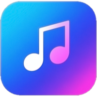
  
  <h1>原音 HQ 播放器</h1>

  <h3>OriginalSound HI-FI Player</h3>

  <h4>
    一款基于 WinUI 3 构建的现代化、高品质全能音乐播放器<br>
    专为 Windows 桌面打造，专注无损音质与沉浸式聆听体验
  </h4>

  <div>
    
    
    
    <a href="https://github.com/Johnwikix/original-sound-hq-player/stargazers"></a>
    <a href="https://github.com/Johnwikix/original-sound-hq-player/releases/latest"></a>
  </div>

  <br>

</div>

<br>

<div align="center">

[**🏠 产品主页**](https://johnwikix.github.io/original-sound-player-page) | [**🐞 反馈问题**](https://github.com/Johnwikix/original-sound-hq-player/issues)

</div>

<br>

## 📥 下载与安装

<div align="center">

| Microsoft Store（推荐） |
| :---: |
| <a href="https://apps.microsoft.com/detail/9NFW1RPPT999?referrer=appbadge&mode=direct"></a><br>通过 Microsoft Store 获取最佳安装与更新体验 |

</div>

## 🌟 核心功能

- 🎵 **音乐库浏览**
  - 按歌曲、艺术家、专辑、文件夹或收藏夹多维分类浏览
  - 手动添加本地文件夹扫描，自动重新扫描实时同步文件变动
  - 一键定位心仪曲目

- 📂 **收藏与播放列表**
  - 创建并管理自定义播放列表
  - 支持将歌曲加入收藏的「最爱音频列表」

- 🎛️ **完整播放控制**
  - 播放、暂停、切歌、随机播放、顺序播放、单曲循环
  - 自定义全局快捷键

- 🔊 **专业音频处理**
  - 支持 DSD、FLAC、WAV、MP3 等 12 种以上音乐格式
  - 音频转换：WAV、MP3、FLAC、OGG、OPUS
  - 内置自定义十段均衡器与多种预设

- 📝 **音乐信息与歌词**
  - 实时展示歌曲标题、创作者、专辑名、时长、采样率、码率、文件类型
  - 支持自动匹配专辑封面与歌词
  - 播放页支持逐字动态动画的高级歌词效果，提供多种着色器背景选择

- 📱 **Sony Walkman 支持**
  - 通过 USB 将匹配元信息的音乐（含歌词）传输至 Sony Walkman
  - 扫描并导入已连接 USB 设备中的音乐

- 🪟 **现代化界面体验**
  - 基于 WinUI 3 构建简洁直观的界面
  - 支持 Mica、Acrylic 等 3 种应用样式
  - 系统默认、深色、浅色 3 套主题
  - 集成 SMTC 系统媒体传输控件
  - 显示专辑原始封面与时间轴

- 🗃️ **数据与基础能力**
  - SQLite 存储音乐库与播放列表数据
  - 单实例运行，窗口最小尺寸保护

## 🎵 音频输出模式

针对不同音质需求提供多种专业音频输出方案：

- **WASAPI 模式**
  - 独占模式（支持推送/事件）减少系统干扰，降低延迟
  - 共享模式可与其他应用共享音频设备

- **DirectSound 模式**
  - 具备硬件加速能力，提升复杂音频或多声道音频播放效率

- **DSD 输出**
  - DSD DoP（封装为 PCM 帧）
  - DSD Native（通过 ASIO 原始输出）

- **ASIO 支持**
  - 原生支持 ASIO 输出，适配专业音频设备

## 🖼️ 软件截图

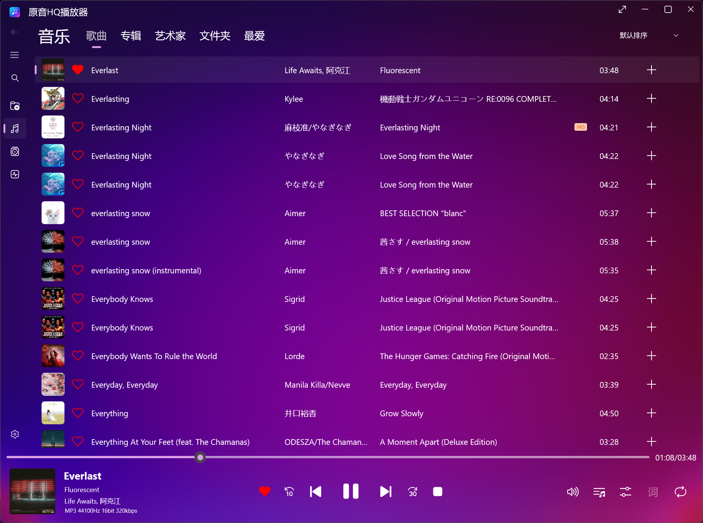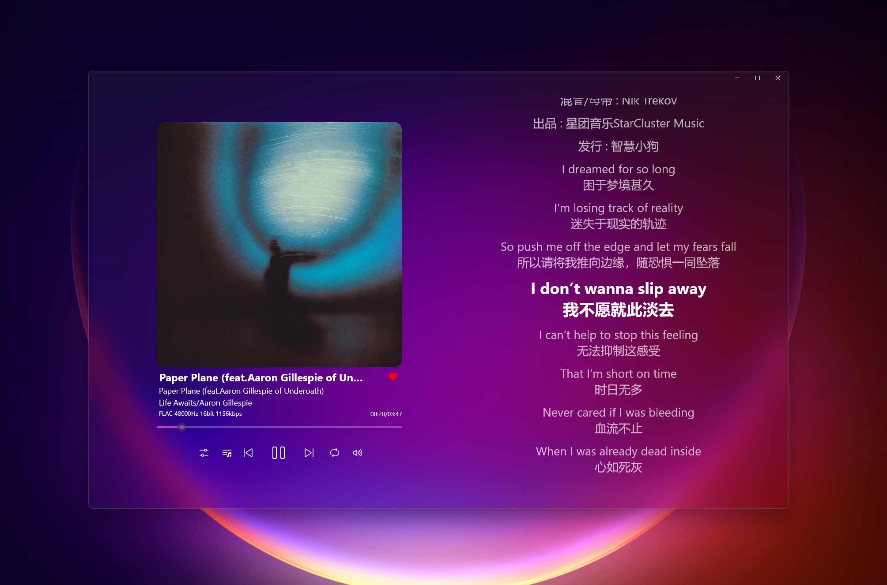
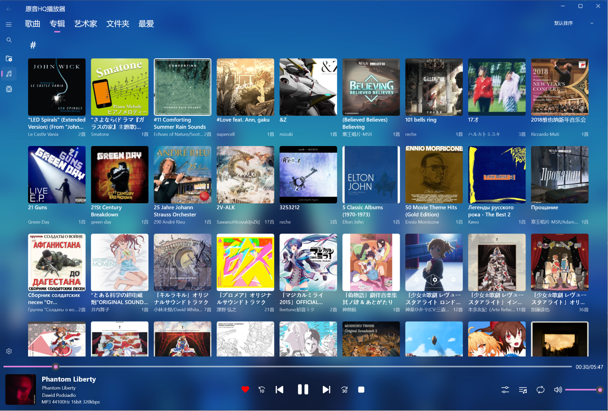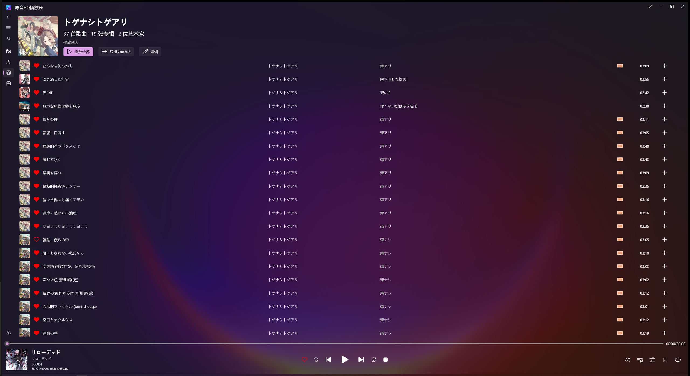
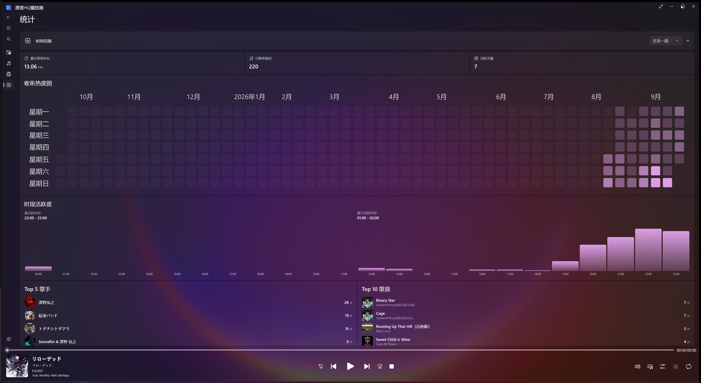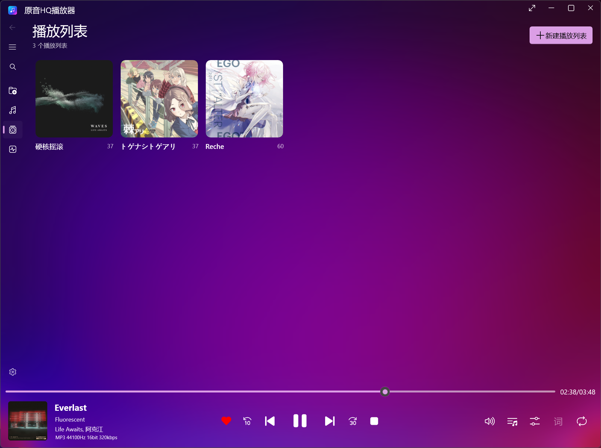
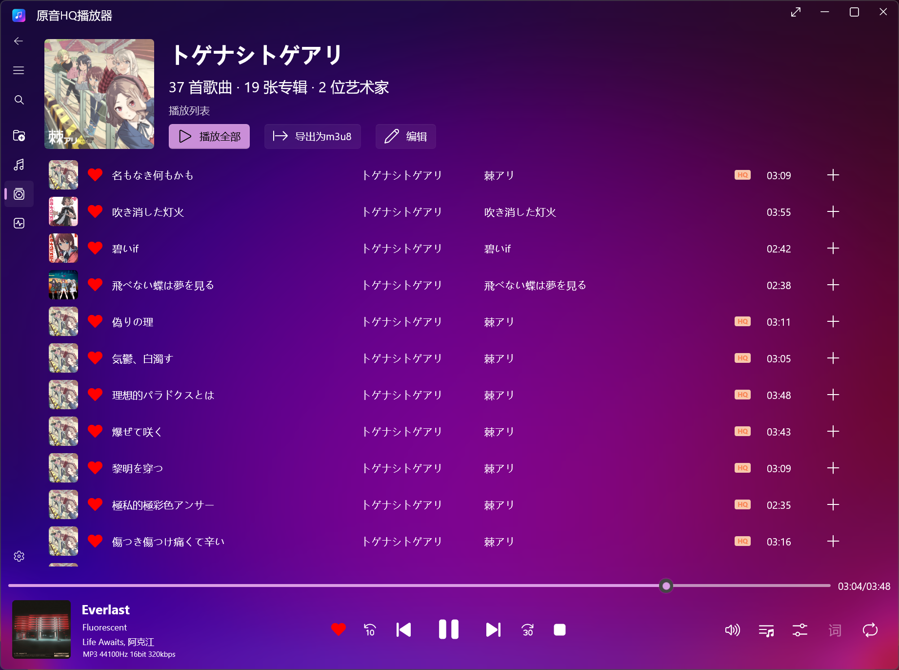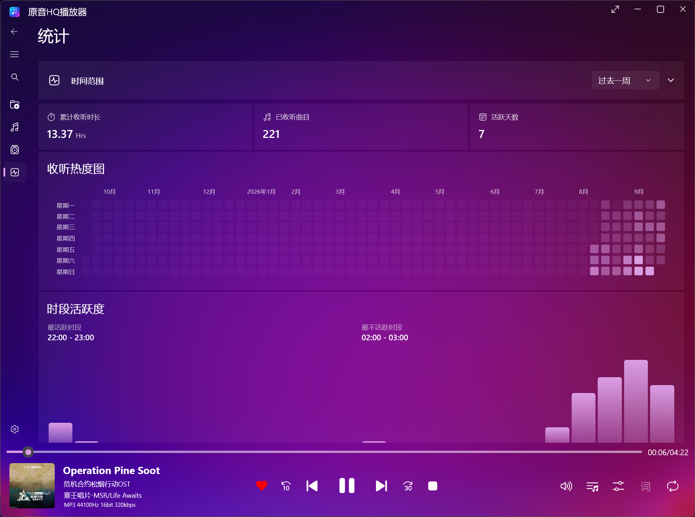
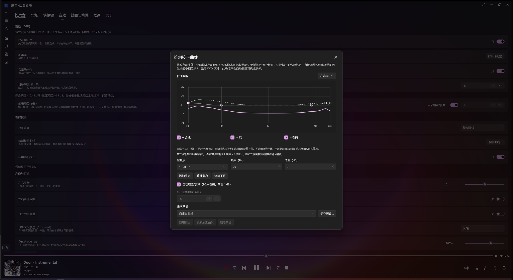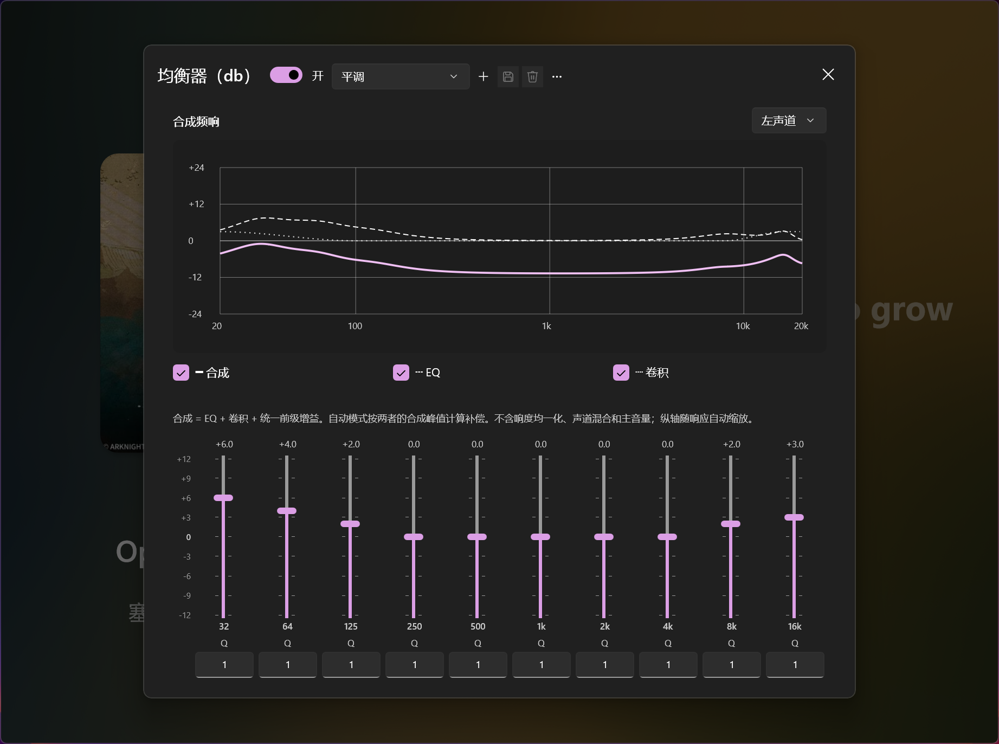

## ✍️ 贡献与构建

欢迎提交 Issue 与 Pull Request。

### 从源码构建

**前置条件**

- [.NET 11 SDK](https://dotnet.microsoft.com/)
- Windows 10 19041 或更高版本
- Visual Studio 2026 及以上，需安装 WinUI 工作负载

**构建步骤**

1. 克隆仓库：
   ```bash
   git clone https://github.com/Johnwikix/original-sound-hq-player.git
   ```
2. 在 Visual Studio 中打开 `WinUIMusicPlayer.sln`，还原 NuGet 包
3. 按 `Ctrl+Shift+B` 构建解决方案
4. 按 `Ctrl+F5` 启动调试

## 💖 依赖与致谢

### 第三方库

| 库 | 用途 | 许可证 |
| :--- | :--- | :--- |
| [H.NotifyIcon.WinUI](https://github.com/HavenDV/H.NotifyIcon) | 系统托盘图标 | MIT |
| [WinUIEx](https://github.com/dotMorten/WinUIEx) | WinUI 窗口功能扩展 | MIT |
| [CommunityToolkit.Mvvm](https://github.com/CommunityToolkit/dotnet) | MVVM 框架 | MIT |
| [DevWinUI](https://github.com/ghost1372/DevWinUI) | WinUI 扩展组件 | MIT |
| [atldotnet](https://github.com/Zeugma440/atldotnet) | 多种音频格式元数据读取 | MIT |
| [BASS](https://www.un4seen.com/) / [ManagedBass](https://github.com/ManagedBass/ManagedBass) | 音频播放引擎 | Non-Commercial |
| [Lyricify.Lyrics.Helper](https://github.com/WXRIW/Lyricify-Lyrics-Helper) | 歌词搜索与解析 | MIT |
| [Isolation](https://github.com/Storyteller-Studios/Isolation) | 着色器流体背景 | MIT |
| [Microsoft.PinYinConverter](https://github.com/stanzhai/MsPinyinConverter) | 拼音转换 | MIT |
| [ZLinq](https://github.com/dotnet/ZLinq) | 零分配 LINQ | MIT |
| [sqlite-net-pcl](https://github.com/praeclarum/sqlite-net) | SQLite ORM | MIT |
| [Serilog](https://serilog.net/) | 结构化日志 | Apache-2.0 |
| [Microsoft.Graphics.Win2D](https://github.com/microsoft/Win2D) | 2D 图形渲染 | MIT |

### 代码参考

- [BetterLyrics](https://github.com/jayfunc/BetterLyrics)
- [WindowsMusicPlayer-TheUntamedMusicPlayer](https://github.com/LanZhan-Harmony/WindowsMusicPlayer-TheUntamedMusicPlayer)
- [HyPlayer](https://github.com/HyPlayer/HyPlayer)
- [DevWinUI](https://github.com/ghost1372/DevWinUI)

## 📄 许可证

本项目基于 [GNU AGPL-3.0 许可证](LICENSE) 授权。

## 📬 联系方式

- 问题反馈交流 QQ 群：一群 `1009034363`，二群 `1033738779`
- 邮箱：[dannypan9709@foxmail.com](mailto:dannypan9709@foxmail.com)

## 🗂️ 数据存储

应用程序数据存储位置：

- 用户数据：`%userprofile%\documents\OriginalSoundPlayer`

---

<div align="center">
  <sub>由 Sennpai Studio 用 ❤ 制作</sub>
</div>