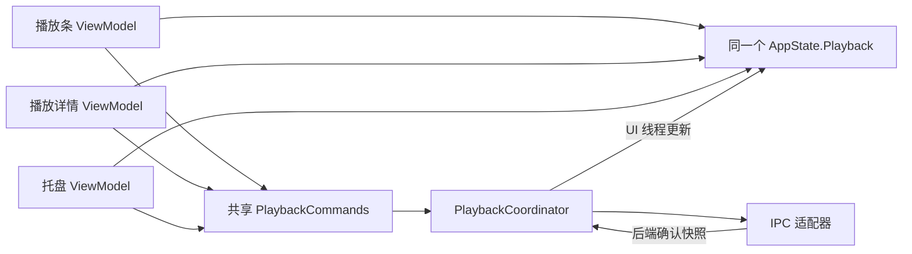

# 共享状态、ViewModel 与服务重构方案

日期：2026-09-20。范围：TODO 第 3—5 项，覆盖项目全部 ViewModel。第 1、2、3 项均保留用户已验收结果。

**核心约束：保留一个跨页面共同使用、可绑定的单例状态入口。重构解决的是多份可写状态、业务副作用和生命周期混杂，不取消跨页同步能力。** 推荐入口名 `AppState`；迁移期可继续保留 `AppViewModel` 名称作为兼容门面，最终由页面 VM 暴露同一个 `State`。

## 本次处理与证据边界

- 第 3 项：新增 `Services/FolderAccessService.cs`，通过构造注入供 `AddFolderViewModel` 使用。打开目录改用 `LaunchFolderPathAsync`，不再要求先取得 `StorageFolder`；返回 false 或 COM/不支持异常时回退 Explorer。添加目录保留现有 App SDK 选择器，仅在 COM/不支持异常时回退绑定 HWND 的 WinRT 选择器。用户取消不会弹第二个对话框。
- `OpenFolderAsync` 实际打开资源管理器，`AddFolderWithLoadingAsync` 才显示选择器。2026-09-20 用户确认第 3 项修复验收通过；不再作为未解决项。实现仍不包含强行终止无返回系统对话框的机制。
- 第 4 项：修复确定的退出中断路径：`TryBeginExit` 先变成 Stopping，再执行取消回调/Changed；原先回调抛异常会跳过保存和清理，之后退出请求又全部返回 false。现在隔离各订阅者异常，协调器记录后继续退出，保留原保存策略和清理顺序。
- 该修复没有证明用户报告的原生致命错误已消除。没有崩溃转储、故障线程栈和实机复现，原生崩溃部分保留待定位，不以猜测替换 IPC/音频释放协议。
- 第 5 项：已按用户“执行”指令实施下列迁移；完整 A—F 仍有剩余边界，不能把本轮构建通过视为整个重构验收通过。

## 2026-09-20 实施记录

### 已落地

- **共享入口**：DI 只注册一个 `AppState`；各主要页面通过 `State` 使用相同对象。稳定子对象包括 Playback、Queue、Library、Browse、Output、DesktopLyrics、Operations、Preferences；偏好进一步按 Appearance / Lyrics / Audio / General 组织。71 个偏好旧字段已删除，AppViewModel 与 Preferences 的平面属性仅转发，通知复用原 PropertyChangedEventArgs，不整树广播。
- **设置效果与保存**：`SettingsCoordinator` 观察偏好子域；静态 AppSettings 目前作为旧消费者的兼容镜像。`SettingsSnapshotFactory` 在 UI 上取快照，数据库写入方法不再直接读取 VM；保留未知/尚未迁移字段，复制快捷键列表，防止后台序列化读取可变 UI 列表。一个在途写入和一个 dirty 位合并编辑，默认调用者还共用异常观察任务。失败可重试；退出重新取最终快照，覆盖未触发的 300ms 桌面歌词防抖。
- **播放**：`PlaybackCoordinator` 接管选曲用例，浏览 VM 接收展示事件。`PlaybackProgressService` 拥有线程安全时钟、50ms 轮询、125ms UI 定时器和 CTS；新一代等待旧一代结束，StopAsync 等待实际任务，停止后不能重建轮询。保留启动恢复歌词发布，只有新播放要求 Ready。IPC 回调在接收和 UI 发布时分别检查停止状态。
- **队列**：`PlaybackQueueState` 同时更新规范成员与随机顺序，切回顺序/持久化不丢追加项，保留重复成员；空曲和库外 Id=0 使用对象/路径匹配。没有把它宣称为完整的逐条目身份模型，见剩余项。
- **退出**：增加 stop → save → cleanup 屏障和命名步骤耗时日志；ApplicationTasks 等待实际工作，取消不冒充完成；收回热键、订阅与定时器。文件夹加载从构造移到显式启动/激活，退出等待本 VM 已发起的操作。
- **统计和导出**：统计按版本保留最新请求，旧范围不能写回，热图只复用对应查询的范围；离页不再订阅 StatsUpdated。USB 使用独立操作 key，按实际成功结果登记格式，失败不记成功；同类导出串行，退出等待当前不可取消的文件转换完成。
- **详情页**：异步菜单命令暴露 IAsyncRelayCommand，异常有日志与现有 InfoBar；播放入口先检查统一条件，删除/重排输入在等待前快照化。去掉 MusicGroupDetailViewModel 静态实例表，控件加载订阅、卸载解绑，可再次激活；控件自行拥有实例，避免根 DI 容器保留 disposable transient。
- **内存**：音乐/歌单引用数组归还池时清空；库索引独立按版本惰性重建。LibraryProjectionService 拥有过滤/排序/分组与固定页面的查询键缓存，键包含库版本、搜索、排序和详情对象；库刷新优先当前页，收藏/歌单映射保留跨页更新。没有在进度热路径复制 AppState，没有新增每 tick JSON 快照或全局消息信封。

### 验证及边界

- Debug x64 完整构建通过；已有 nullable / XAML / trim 警告仍存在。
- LifecycleRegression、FolderScanRegression、SettingsPersistenceRegression、LyricsCoverRegression、CurvePresetRegression 通过；PlaybackSwitchRegression **281/281** 通过。最初并行基线构建出现共享 DLL 写入冲突，改为串行重跑通过。
- SharedStateRegression 链接生产队列、保存队列、任务屏障、USB writer、StatsViewModel、LibraryQueries 和 LibraryProjectionService。UI 边界用单线程同步上下文及可控定时器/异步查询替身；USB 使用实际临时文件，转换器为可控替身。验证 1,000 次同轮编辑只启动一轮写入，慢写期间新编辑形成第二轮且 flush 覆盖最终值，失败保留待重试状态。
- 静态核对 71 个迁移偏好的默认值与 HEAD 完全一致；新增 `GetString("Error")` 在六种语言均有独立键。构建/替身测试不证明原生 WinUI、音频设备或移动磁盘实机表现。
- 未采集同包/同库/同设备的 Release ETW、GC/分配和交互延迟对照；上述数字为回归场景的调度次数，不是产品性能收益百分比。

### 仍需迁移/实机验收

1. AppViewModel 仍有窗口/快捷键、设备枚举、库投影调度与部分兼容入口；SettingsCoordinator 通过显式注入的兼容门面调用现有展示/热键适配，尚未完全去除这个反向依赖。静态 AppSettings/AppData 也尚未全部退场。
2. LibraryProjectionService 已实现查询键复用及隐藏页按需刷新，但仍须连同缓存页面导航做 WinUI 验收；大库过滤/排序仍在 UI 调用线程执行，后台稳定快照计算需结合实测继续实施。
3. 队列重复成员得以保留，但同一 Music 引用重复出现时，当前歌曲定位仍沿用首次匹配；逐条目稳定 ID 与精确游标恢复仍需完成。
4. Dsp/卷积编辑器的既有打开/关闭提交逻辑及用户已验收草稿语义保持；完整编辑器退出提交登记、所有原生资源/SMTC 在途操作的统一生命周期仍需继续梳理。
5. 原生退出致命错误仍需转储与实机复现；桌面歌词开关、拖动设置后立即退出、大库切页、USB 拔盘、长时间播放和 GC 对照尚未完成实际设备验证。

下面的审查位置和行数记录的是**实施前基线**，并不表示全部问题仍保持原样；上述记录是当前实施状态。

## ViewModel 审查范围和方法

逐文件检查 `ViewModel/**/*.cs` 及 `DesktopLyrics/DesktopLyricsViewModel.cs`，共 **28 个源文件、9,420 行**（包含空行/注释，排除生成文件和外部库）。`AppViewModel` 五个 partial 合计 **3,849 行**：主文件 1,583、Settings 2,084、Atmos 81、License 72、Surround 29。partial 只是文件划分，仍是同一个职责集合。

同时追踪 `App.xaml.cs` 注册方式、启动/退出登记、播放与数据库服务、AppSettings/AppData、USB 写入、控件 Loaded/Unloaded、页面 XAML 绑定、消息总线及进度邮箱的实际边界。下面的缺陷均为当前代码已有问题，不是本轮文档更新引入；静态调用链成立不等于已在故障机器复现。

### 可定位的行为问题

| 编号/优先级 | 位置与触发链 | 影响 | 修复方向与验证 |
| --- | --- | --- | --- |
| R1 / P1 | `Pages/MusicBrowseViewModel.cs:397` 仅检查 IsPlaybackEngineReady；该值在 Stopping 后不会自动复位。`Services/BassPlayerCommandService.cs:35` 的 PlayState/PlayEnded UI 回调无退出守卫，PlayEnded → AutoPlayNextTrack → PlayMusic；`AppViewModel.cs:512` 的 StartProgressTimerCore 不检查 `_isDisposed` | 退出期间迟到通知仍能触发播放、改当前曲和启动轮询；已 Dispose 的 VM 也能重建 CTS/计时器。统一 PlaybackCommands 的守卫覆盖不到这些入口 | 播放用例统一检查阶段/代数，所有入口（包括自动下一首）经过它；停止通知生产者并等待任务，UI 回调再次检查代数；测试在 Stopping/Dispose 后投递 PlayState 和 PlayEnded，无重启/新命令 |
| R2 / P2 | `AppViewModel.Settings.cs:738` 自有字段只单向写 `DesktopLyricsViewModel.IsKaraokeEnabled`；后者在 `DesktopLyricsViewModel.cs:106` 又持有独立字段。`LyricsSettingsControl.xaml:466` 绑定前者，TrayViewModel 和快捷键修改后者 | 托盘/快捷键改变实际逐字效果后，设置页开关与依赖卡片可仍显示旧值；这是公共值多源导致的确定同步缺口 | 所有入口绑定/修改同一个 DesktopLyricsState；旧属性只转发 getter/setter 和通知，不保留字段。覆盖设置页↔托盘↔快捷键双向变化及重启恢复 |
| R3 / P2 | `AppViewModel.cs:1011`、`:1021` 只向 CurrentPlayingList 插入；随机模式在 `:81`/`:167` 使它成为 SequentialPlayingList 的副本；切回顺序在 `:85` 替换，`PlaybackStatePersistence.SaveAsync` 保存 SequentialPlayingList | 随机模式追加的歌曲在切回顺序或重启后消失 | QueueState 统一维护队列成员及随机播放顺序；Append/InsertNext 同时更新规范成员与活动顺序。用“随机→追加→顺序→重启”验证，另覆盖重复歌曲和外部 Id=0 曲目 |
| R4 / P2 | `AppViewModel.Settings.cs:825` 的 300ms 样式计时器触发后才 SaveSettingAsync；`AppViewModel.cs:1459` 未停止/刷出该计时器，StartupCoordinator 的 RegisterSave 只保存播放状态/统计，没有等待设置保存队列 | 刚调整样式就退出时，最后一次设置可能未保存；已排队保存也未纳入退出屏障。不能依赖退出刚好耗时超过 300ms | SettingsCoordinator 管理 dirty/version、防抖和可等待 FlushAsync；退出先封闭新编辑，再提交最终快照并等待保存。验证 300ms 内退出、慢盘、写盘失败、恢复设置时不触发保存 |
| R5 / P2 | `StatsViewModel.cs:174` 用 `if (IsLoading) return` 丢弃新查询；范围选择在请求中改变且 500ms 定时器先于旧查询完成时，新加载直接返回，旧结果照常发布；`:200` 又使用当前范围决定是否复用旧快照日统计 | 下拉框显示新范围但图表/Top 数据属于旧范围；切到“过去一年”还可能误复用旧时间段的日统计 | 捕获不可变查询参数与请求代数，保留最新待执行请求，旧结果不得发布；热图复用判断只用该快照的查询范围。用可控延迟跨越 500ms 复现 |
| R6 / P2 | `AppViewModel.cs:1411` 把整个发送输入按请求扩展名传给 AddSentRecords；`Helper/UsbWriterHelper.cs:75` 转码失败会回退原格式，`:94` 单文件失败只记录后继续，方法不返回逐项结果 | USB 复制失败也可能显示“已发送”，回退复制成功却登记错误扩展名 | 写入层返回每项成功/失败、实际路径/格式，台账只登记成功项；总进度完成不表示全部成功。覆盖不存在源文件、拔盘、转码失败后复制成功 |
| R7 / P2 | `Controls/MusicGroupDetailViewModel.cs:92`、`Controls/PlaylistDetailViewModel.cs:80` 用 RelayCommand 接 async lambda，转换为 async void；例如歌单移除 `PlaylistDetailViewModel.cs:346` 等待 DB 无命令级异常处理 | 操作任务不受命令追踪，重复执行可重入；失败逃到全局异常处理，无法由 UI 命令反馈/取消/收尾。App 的全局 Handled=true 不能补回这些语义，因此不直接声称必然崩溃 | 使用 IAsyncRelayCommand 和任务化用例，快照化输入，在边界显示失败并观察异常；明确串行/最新意图/可并行策略，不能对全部操作统一单飞 |

R1 属于退出可靠性优先修复项，但没有证据把用户报告的原生致命错误直接归因于它。特别地，`External/BassPlayerIpc.Shared/ProgressMailbox.cs` 已用同一锁保护 TryRead 与 Dispose，不能仅凭 VM 未 await 轮询就断言发生该邮箱的释放后裸指针访问。

### 性能、保留与生命周期观察

- `AppViewModel.RefreshAllViews`（`:1062`）在 UI 调用线程扫描/排序多个列表并重建三个分组；`UpdateSongCollectionsAsync` 的过滤/排序发生在第一个 await 之前，async 名称不代表后台计算。`MusicGroupDetailViewModel` 同时监听三类集合，任一变化都可能重扫完整 SongsSource 计算当前详情标题。应按库版本/查询键缓存、只更新活跃投影；后台计算须用稳定快照，不能直接跨线程枚举 UI 的 List/Span。
- `AppViewModel.cs:886/1007/1145` 及 Album/Artist/Folder 的引用类型池数组以 `clearArray:false` 归还，池中会暂时保留 Music/PlayListMusicItem 引用。应在归还前清除已使用引用范围并验证所有权；这是保留风险，未做堆测量，不声称无限泄漏或具体内存收益。不要把已有 ArrayPool 再包装一层当作性能重构。
- `StatsViewModel.OnPageInactive` 为空，构造订阅 StatsUpdated，退出页面后仍能查询统计和重建图表。应停止计时器、取消/失效发布，仅把共享的统计领域数据保留在服务中。
- AppViewModel 构造订阅许可、USB、集合、LyricsSyncRequestBus，Dispose 没有对应完整解绑；设置广播计时器也未停止。MusicGroupDetailViewModel 用静态 `_instances` 强引用登记，控件 Unloaded 仅 SetView(null)，没有销毁登记入口。页面缓存期保留是正常行为，但真正淘汰/销毁时必须注销；不能把每次 Unloaded 都简单视为最终 Dispose，否则缓存页面再显示会失去订阅。
- AddFolderViewModel 构造即 LoadFoldersAsync，静态扫描门订阅没有生命周期终点；转换、重新下载歌词、USB 任务没有统一的停止/等待归属。事件取消、任务完成、原生句柄释放必须分别建模。
- DspSettingsViewModel、ConvolutionCurveViewModel 已有 Loaded/Unloaded 或 Open/Close 边界，FrequencyResponseViewModel 有取消与迟到结果守卫，应保留；但应用退出还需纳入其提交/后台计算任务。频响缓冲和曲线 Points.ToArray 是否值得优化应按拖动频率测量，不能为冷路径引入复杂池化。
- `SaveSettingAsync` 已有 `_settingsSaveGate` 保持写入顺序，不能报告为“毫无串行化”。真正需要改的是每个属性变动都构建/序列化全量快照、队列缺少合并与最终 flush，以及持久层反向读取 VM。

### 全部 ViewModel 的覆盖与归属

路径以 `ViewModel/` 为基准，DesktopLyrics 单独注明；“保留”不代表已做实机证明。

| 文件/逻辑类 | 当前职责与审查结论 | 目标归属 |
| --- | --- | --- |
| AppViewModel.cs | 播放/队列、索引、搜索/分组、窗口、歌词/进度、批量业务混合；R1/R3/R6 | 拆状态拥有者及用例；兼容门面只转发 |
| AppViewModel.Settings.cs | 偏好、写盘、设备枚举/切换、窗口、热键、目录混合；R2/R4 | Preferences 子域 + SettingsCoordinator/Windows 适配器 |
| AppViewModel.License.cs | 许可投影和共享购买命令；构造匿名订阅需收尾 | LicenseState + 共享购买用例 |
| AppViewModel.Atmos.cs | 用户选择与后端实际状态并存 | AudioPreferences 与 OutputState 分开，保留稳定端点语义 |
| AppViewModel.Surround.cs | 5.1 实际状态与关闭偏好入口 | OutputState 与音频设置用例 |
| Pages/MainViewModel.cs | 聚合依赖，本身很薄；暴露底层播放器扩大调用面 | 共享状态入口 + Shell/Playback commands |
| Pages/SettingsViewModel.cs | 几乎仅转发 AppViewModel；业务仍全在上帝类 | 按卡片组合偏好编辑 VM，绑定共享偏好 |
| Pages/MusicBrowseViewModel.cs | 播放用例、封面管线、导航、页面引用集于一身；R1 | PlaybackCoordinator/CoverPresentationService/导航适配；页面只展示 |
| Pages/PlayingDetailViewModel.cs | 播放命令已复用；模式切换仍重复，歌词索引直接改全局列表 | 共用完整播放命令组；详情布局属性保留本地 |
| Pages/SongListViewModel.cs | 列表选择、队列赋值、文件删除、转换及菜单 | 本地选择 + TrackActions/Queue 操作 |
| Pages/FavouritePlayListViewModel.cs | 与歌曲页重复，收藏拖排另有 Order 语义 | 复用操作组合，保留收藏排序用例，不强行继承一个巨型基类 |
| Pages/AlbumViewModel.cs | 分组导航/菜单与播放源构建 | Album 查询投影 + 明确的播放源参数 |
| Pages/ArtistViewModel.cs | 艺术家拆分查询/导航/播放 | Artist 查询投影，保留多歌手规则 |
| Pages/FolderViewModel.cs | 文件夹聚合/重扫/播放 | Folder 查询与 LibraryCoordinator；现有按末级目录名聚合语义单独记录，不偷改 |
| Pages/PlayListViewModel.cs | 歌单管理、全局详情选择和播放，订阅未显式收尾 | Playlist 用例 + BrowseSession.SelectedPlaylistId |
| Pages/AddFolderViewModel.cs | 平台交互已注入，仍有构造 I/O 和静态扫描依赖 | 显式 Activate/Deactivate，扫描任务由 LibraryCoordinator 拥有 |
| Controls/MusicGroupDetailViewModel.cs | 三类详情投影、重复菜单操作、静态实例表、强视图引用；R7 | 控件作用域 VM + shared queries/actions；取消静态实例广播 |
| Controls/PlaylistDetailViewModel.cs | singleton VM 持控件引用、全局歌曲集合与异步命令；R7 | 共享歌单数据，本地选择/视图；重排有单独任务与事务 |
| Controls/DspSettingsViewModel.cs + .DeviceCorrections.cs | 偏好编辑、后端投影、IR 导入、设备绑定/重试 | 保留编辑 VM，应用用例负责导入/绑定/提交；明确保存成功与后端应用成功 |
| ConvolutionCurveViewModel.cs | 编辑草稿/预设/实时预览，已有提交任务合并 | 编辑器本地节点/选择；共享会话草稿由 CorrectionSession 拥有，保留 TODO 1 语义 |
| FrequencyResponseViewModel.cs | 频响计算/缓存、取消与结果发布 | 计算器 + 页面展示 VM；缓存有界、关闭停止，保留 latest-result guard |
| AudioConversionViewModel.cs | 转码进度对话框、批量工作、刷新库 | Export/ConversionCoordinator + 展示 VM；跨入口共用任务身份与停止屏障 |
| StatsViewModel.cs | 时间查询、图表/Top 投影；R5 和离页仍加载 | 本地范围与图表状态 + 查询服务；活跃生命周期、最新请求生效 |
| TrayViewModel.cs | 已复用 PlaybackCommands 与生命周期守卫，方向正确 | 保留，共用 State 与 ShellCommands；只移出页面解析 |
| UserAgreementViewModel.cs | 职责独立、保存忙态/错误明确 | 保留边界；启动退出取消由启动用例提供，不并入 AppState 所有字段 |
| ProgressCenter.cs | UI 线程汇总、按 key 显示进度 | OperationsState 展示投影；多 USB 任务用唯一 operation id，避免同 key 互相 Complete |
| DesktopLyrics/DesktopLyricsViewModel.cs | 共享开关/样式/边界与建窗/写盘耦合；R2 | DesktopLyricsState + 窗口适配器 + 偏好持久化 |

## 当前依赖与风险位置

| 位置 | 已核对的现状 | 重构边界 |
| --- | --- | --- |
| `StartupCoordinator` | 同时负责窗口/协议、缓存恢复、音频连接、后台扫描、服务解析和清理登记 | 保留编排职责，业务工作移交有明确开始/停止契约的服务 |
| `ShutdownCoordinator` | 保存 → 停 Host → 逆序清理；释放顺序依赖登记顺序 | 先停止新工作、等待已有工作，再快照保存和释放依赖；分阶段声明顺序 |
| `MusicDatabaseService.Initialize` | 初始化数据库后从全局容器取得 AppViewModel；数据库服务混合持久化、扫描与 UI 状态 | 仓储返回数据/提交结果，不依赖 VM；应用层负责 UI 发布 |
| `BassPlayerCommandService` | 构造时全局解析 IPC 并订阅通知，通知直接调度更新 AppViewModel | 播放用例、协议传输、UI 投影拆开；通知订阅由显式生命周期管理 |
| `IpcService` | 同时持有 MMF/信号量/监听任务、许可逻辑、设置发布及 VM；Dispose 同步等待工作任务 | 通道拥有原生资源，用例负责策略，停止异步等待真正结束 |
| `IpcService.UpdateDeviceCorrectionsAsync` | 持门后在线程池发布 correction mailbox；Dispose 不经该门释放 mailbox | 需要验证发布与释放交错；停止拒绝新发布，等待当前发布再释放，不能只取消等待 |
| `PlaybackStatsService` | 构造时订阅 VM 进度事件 | 会话统计消费播放状态事件，Start/Stop 明确管理订阅及最终结算 |
| `AddFolderViewModel` | 构造启动加载并订阅静态扫描门；操作依赖窗口与全局服务 | 页面加载显式初始化；平台交互已独立，后续补取消、停止及解除订阅 |
| `LibraryWatcherService` | 已有有界信号队列、显式 Start/Stop、停止后防重启 | 保留已验证机制，替换静态扫描入口，不另造一套扫描并发门 |

上述是设计和代码路径证据，尚未复现的竞态不等同于已确认崩溃根因。

## 目标职责、状态与所有权

### 一个公共入口，同一份可观察状态

推荐保留一个单例 `AppState`，它是稳定的对象图入口，不是把每个页面数据再拷贝一份的同步中介。各页面都能通过 `ViewModel.State` 访问公共值；依赖较少的 VM/用例可以直接构造注入某个子状态。两种注入方式必须指向同一实例，不允许根对象 `new PlaybackState()`、容器又注册另一份 PlaybackState。

```text
AppState（单例；子对象引用在运行期保持稳定）
├─ Lifecycle          复用现有 AppLifecycle，阶段唯一来源
├─ Playback           当前曲、确认播放状态、队列、模式、进度展示
├─ Library            已加载曲目/歌单的可观察只读视图、库版本
├─ Browse             公共搜索/排序、各 tab 跨导航保留的详情定位
├─ Preferences
│  ├─ Appearance      主题、背景、字体、布局偏好
│  ├─ Lyrics          主歌词与桌面歌词持久偏好
│  └─ Audio           输出偏好、EQ/DSP、稳定设备选择
├─ Output             后端确认的设备、渲染格式、Atmos/5.1/DSP 状态
├─ Lyrics             当前歌词内容/曲目标识/加载状态
├─ CorrectionSession  跨输出保留的本次运行校正草稿与应用代数
├─ Shell              当前路由、窗口可见/全屏、返回可用性
├─ DesktopLyrics      窗口运行状态、样式投影、边界
├─ License            许可只读投影
└─ Operations         任务列表/进度/错误展示
```

以上是职责图，不要求一次创建全部类型，也不以子类数量作为完成标准。Preferences.Lyrics 的桌面歌词开关是其唯一持久值，DesktopLyrics 的同名便捷属性只能代理，不能另存可写字段。



**状态与操作分开，但跨页入口不分裂：** 播放条和详情页均绑定 `State.Playback.CurrentTrack`、`State.Playback.IsPlaying`，均调用 `PlaybackCommands.PlayCommand/PauseCommand`。设置页和托盘均访问同一个桌面歌词偏好对象。修改后由子对象的 PropertyChanged 通知所有绑定者，不经过“页面 A 事件 → 页面 B setter → 页面 A”的循环。

可以继续使用现有名称 `AppViewModel` 作为轻量根入口，例如 `AppViewModel.Playback`、`.Preferences`、`.Shell`；重构价值来自状态和职责边界，改名本身没有价值。推荐新页面 VM 暴露 `State`，旧属性作为阶段性兼容转发，最后清除它们。

### 写入规则与双向交互

1. **纯 UI/低风险偏好**：例如公共搜索词、排序选择、主题偏好，允许直接双向绑定共享子状态；setter 只验证/规范化值并通知。SettingsCoordinator 订阅明确的偏好变更，负责应用主题、合并保存；设置恢复使用显式 Restore 阶段，不触发用户编辑副作用。
2. **涉及后端或事务的状态**：CurrentTrack、IsPlaying、活动队列、设备实际状态对页面只读，由唯一用例服务写入。用户点击通过共享命令；拖动进度使用本地 DragPosition，提交 Seek 后再由确认进度更新共享时间。避免一次 UI 显示刷新又发起一次 Seek。
3. **期望与实际分别命名**：VolumePreference/DesiredOutput 表示用户期望，EffectiveVolume/ActualOutput 表示后端确认；这是不同语义，不能混为同一个“同步字段”。后端音量回写是否更新用户偏好要有显式来源规则，不能再次循环发命令。许可受限时保留偏好，实际状态由 LicensePolicy 和后端结果决定。
4. **编辑草稿与应用值分开**：曲线编辑节点、选中点、未提交预设名属于编辑器；跨设备且仅本次运行有效的自定义校正草稿属于 CorrectionSession，保持 TODO 1 已验收语义。取消编辑/提交失败不得误覆盖持久偏好；DSP 保存与后端应用失败分别呈现。
5. **集合单一拥有者**：公开只读可观察集合或只读接口；Append/Remove/Reorder/ReplaceQueue 由对应 owner 执行。随机播放用同一队列成员集合与播放顺序表达，不允许页面分别修改两份独立集合。队列条目需独立身份，支持重复歌曲；外部曲目 Id=0 不能只靠数据库 Id 区分。

全局共享状态在 UI 线程写入并发布 PropertyChanged/CollectionChanged/CanExecuteChanged。工作线程仅使用捕获的不可变请求、查询结果或专用线程安全时间线。关联状态更新先设置同一操作的全部字段，再发通知；集合使用批量提交，不在半更新期间 await。子状态自己通知，不让每次 50ms 进度变化触发整个 AppState 的刷新/全量快照。

XAML 绑定应写到叶子对象，例如 `State.Playback.IsPlaying`（OneWay），`State.Browse.SearchText`（TwoWay）。子对象实现 INPC、根引用保持稳定即可，根不必转发所有叶子的 PropertyChanged。兼容旧路径时，旧属性 getter 从新状态读取、setter 委托同一操作，并转发对应属性通知；不能保留旧字段再双向对拷。具体绑定模式和依赖路径需通过真实编译 XAML 验证。

### AppViewModel 成员迁移表

| 当前成员/外部写入者 | 唯一状态归属 | 唯一操作/资源拥有者 | 页面可保留部分 |
| --- | --- | --- | --- |
| CurrentPlayingMusic、IsPlaying、Volume、CurrentPlayMode；MusicBrowseVM/BassPlayerCommandService/DB 恢复写入 | PlaybackState；后端确认与用户意图区分 | PlaybackCoordinator + PlaybackCommands | 播放按钮呈现、拖动手势 |
| SequentialPlayingList、CurrentPlayingList、AddMusic*；歌曲/收藏/专辑/歌手/文件夹/歌单/详情及 MusicCommands 写入 | QueueState（Playback 子状态） | 同一队列用例，恢复也走该入口 | 选择哪些曲目作为请求输入 |
| `_cache`、轮询 CTS/task、progress timer、CurrentPlayingTimeChanged | UI 进度投影在 PlaybackState，线程安全时间线独立 | PlaybackProgressService 持 timer/CTS/task，StopAsync 等待退出 | 进度条临时拖动位置 |
| SongsSource、五类索引、AllPlayList、AppData.AllPlayListMusics | LibraryState 的只读数据/版本；索引由查询层拥有 | LibraryCoordinator/LibraryQueries/PlaylistRepository | 页面当前查询结果投影 |
| SearchText、SelectedSortOption、CurrentAlbumObj/ArtistObj/FolderObj、CurrentPlayListId | BrowseSession 中公共搜索/排序与每 tab 详情定位 | BrowseQueries/NavigationCommands；定位使用稳定 key | SelectedMusic/SelectedMusics、滚动位置由页面或 tab 会话保存 |
| ListSongs/FavoriteSongs/AlbumSongs/ArtistSongs/FolderSongs/PlayListSongs、CollectionViewSource | 稳定查询缓存可共享，同一查询可共用结果；CollectionViewSource 留 UI 投影层 | LibraryQueries 按库版本+过滤+排序管理更新 | WinUI 分组视图、选择和虚拟化状态 |
| 大量 Settings 属性、AppSettings 重复字段、SaveCurrentSettings 反向读取 | Preferences 子域唯一运行时偏好 | SettingsCoordinator 合并 dirty/应用副作用/flush；仓储只收 DTO | 输入验证、错误文本、设置卡片显示 |
| SelectedDevice/BassOutputDevices/AtmosEndpointId；实际 Atmos/Surround 状态 | AudioPreferences 与 OutputState | DeviceCatalog/AudioSettings use cases | 下拉框呈现、忙态/失败重试 |
| UILyrics、LastLyricIndex、LyricPagePalette/Artwork、MusicInfo | LyricsPresentationState/NowPlayingPresentation | LyricsLoader/CoverPresentationService（任务代数、取消、收尾） | 字号与布局换算、控件渲染 |
| IsFullScreen/IsMaximized/IsBackBtnEnable/PageType/IsPlayingDetailVisible | ShellState；AppData.CurrentPage 不再独立写 | ShellCommands/NavigationAdapter/WindowAdapter | 窗口句柄、Frame、动画留视图/适配器 |
| DesktopLyrics* 偏好、桌面窗口 style/bounds | Preferences.Lyrics + DesktopLyricsState 的派生投影 | DesktopLyricsWindowAdapter + SettingsCoordinator | 一份公共值，所有页面共用，不在两个 VM 存开关 |
| LicenseRestricted/PurchaseLicenseCommand | LicenseState | LicenseService/共享购买命令 | 文案与控件许可可用性 |
| ReGetLyrics/RescanFolder/TransmitFileToUsb/EditPlayListName | OperationsState 展示任务，领域状态各自归属 | Lyrics/Library/Export/Playlist 用例 | 确认框与请求参数 |
| UpdateMenuOptionsPlayList/UpDateUsbDeviceMenuflyout/静态实例广播 | Library/Device 共享目录数据 | 各活跃菜单投影订阅共享目录，按需构建 | 菜单项与 CommandParameter |

`AppData.IsPlaying`、`AppData.CurrentPage`、`AppSettings` 当前是额外读写通道，必须纳入迁移。持久化 DTO 是磁盘快照，不能作为第二个可写运行时状态；后台音频配置快照可由 Preferences 单向生成并按版本原子发布。最终基础设施不通过 App.Services 取得 AppViewModel。

### 服务依赖方向

View → 页面 ViewModel → 共享命令/应用用例 → 仓储/播放通道/Windows 适配器。页面和用例共同依赖需要的共享子状态，基础设施返回 DTO/通知而不反向依赖 ViewModel 或窗口。容器解析集中在 `App` 的组合入口；页面延迟创建通过类型明确的工厂完成，避免向业务服务传递整个 `IServiceProvider`。

| 边界 | 职责与状态 | 生命周期/线程 |
| --- | --- | --- |
| AppLifecycle | 唯一应用阶段；引擎就绪仍是独立条件 | UI 线程迁移，后台只读/观察取消 |
| PlaybackState/QueueState（分阶段引入） | 当前曲、队列、播放意图与后端确认状态 | 同一共享对象供页面绑定，由播放用例拥有写权限，不在页面复制这些字段 |
| Playback use cases | 显式 Play/Pause、切曲、设置切换、外部文件播放 | 串行化冲突操作；保留最新显式意图，不以单飞丢弃命令 |
| AudioSession/IPC transport | 音频子进程、连接、协议读写、监听任务、MMF/信号量 | 拒绝新请求 → 取消 → 等待监听/发布结束 → 释放映射和句柄 → 收尾子进程 |
| LibraryCoordinator | 扫描、监视、增量提交、队列协调 | 共用现有 LibraryOperationGate；每项工作有可等待任务及取消令牌 |
| Repositories | SQLite 查询、事务、设置与统计持久化 | 不持有 UI；连接最后释放；保持现有库格式 |
| UI dispatcher adapter | 属性、集合、命令通知发布 | 仅此边界跨入 UI 线程；迟到回调用代数/生命周期守卫丢弃 |
| Windows adapters | 文件夹、USB、SMTC、窗口/托盘 | 显式 Start/Stop，原生回调停止后再销毁窗口 |

不要一次迁移所有 AppViewModel 状态：每轮选择一个状态组，先迁移所有写入口，再迁移读入口，删除旧字段，避免双向同步形成两个状态源。热路径不使用通用事件总线、反射服务定位或每条通知创建通用字典。

## 分阶段实施（以共享状态为核心修订）

| 阶段 | 修改范围与交付 | 验收门槛 | 回退 |
| --- | --- | --- | --- |
| A：行为证据与退出止损 | 给生命周期步骤命名；梳理资源/订阅；单独修 R1/R4，补真实调用边界回归 | 迟到 PlayEnded/PlayState 不重启；最后一次偏好可靠 flush；单项失败不跳过其他清理；不在热路径逐条写日志 | 与结构迁移分开提交，不改协议/库格式 |
| B：共享状态最小切片 | 注册一个 AppState 与唯一子实例；先迁移桌面歌词公共开关 R2，设置页/托盘/快捷键共用；旧字段删除只留代理 | 三入口实时同步、属性/集合通知在 UI 线程、恢复不误写盘；新增状态类不解析服务或窗口 | 一次迁移完整字段读写闭环，可整体回退该切片 |
| C：播放及队列所有权 | 拆 Playback/Queue/Output 状态、PlaybackCoordinator/ProgressService；迁移全部页面和 MusicCommands 写入口，修 R3 | 快速 Play→Pause→Play、随机追加/重排/恢复、Id=0 外部曲、输出切换、退出迟到消息；真实 IPC 与 XAML 回归通过 | 保留旧 API 转发但不保留旧状态；不修改线协议 |
| D：偏好与保存 | 拆 Appearance/Lyrics/Audio；SettingsCoordinator 接管防抖与保存，SaveCurrentSettings 不读 VM；移出热键/建窗/目录副作用 | 更改同一值不重复提交；慢盘合并有界、失败可重试、退出等待最终版本；旧设置完整兼容，许可保留偏好 | 每组偏好独立迁移，磁盘 DTO 保持兼容；不改默认值 |
| E：音乐库/浏览/页面 | 建 LibraryState + BrowseSession；数据库去 VM 依赖，按版本缓存查询；迁移页面/详情选择与操作组合，修 R7 | 多页面公共搜索/排序保持现有语义；恢复详情/滚动；缓存首屏、扫描批次、当前曲身份、队列及元数据保护全部回归通过 | 按页面族迁移，不同时更改分组/排序产品语义 |
| F：外围与清理 | 统计查询最新请求 R5、USB 逐项结果 R6、歌词/封面/转换任务、SMTC/窗口生命周期；去除旧 facade 字段和静态实例表 | 隐藏页无无用工作；部分失败准确呈现；关闭功能后任务/句柄/订阅收敛；退出覆盖所有在途任务 | 每个外围服务单独提交和验收 |

推荐顺序 A → B → C → D → E → F。先用桌面歌词同步这个小闭环验证共享状态设计，再迁移高风险播放领域。AppViewModel 在每阶段只减职责；禁止搬到一个同样庞大的 AppStateService 或把它拆成互相解析的多个上帝类。

退出屏障贯穿各阶段：服务需显式 StopAsync；停止输入与生产者，等待启动/扫描/命令/发布实际结束，UI 上生成快照，后台持久化，然后按依赖顺序释放。每迁移一个拥有任务的服务，都要同时接入屏障，不把全部生命周期工作留到 F。

每个切片的完成条件：列出所有写入口（含 Services、View code-behind、AppSettings/AppData、恢复逻辑）、替换后搜索确认旧字段不再存值、验证双向入口同步与 UI 通知、核对停止所有权、做真实 XAML 绑定验证。仅编译通过或文件变短不算完成。

退出目标顺序：切换 Stopping、拒绝新用户工作 → 关闭监视/设备/设置等生产者 → 取消并等待在途启动与业务任务 → 在 UI 上冻结待保存快照并完成持久化 → 解绑通知并停止 IPC 线程 → 释放通道/子进程 → 清理 UI/窗口及最后的数据库和日志。

等待超时只能用于诊断和明确的隔离策略，不能把 WaitAsync 超时当作原任务已停止，随后直接释放仍在使用的句柄。IPC 卡死应先判断子进程与本进程的资源边界，再设计强制终止策略；保持 UI 消息泵运行，避免 UI 同步 Join 等待需要 UI 回调的任务。

## 性能与内存分配/回收：设计约束和验收门槛

性能与内存是 A—F 各阶段的完成条件，不能等拆分结束再补。先采集当前同配置基线，比较相同运行包、音乐库、设备、输出模式和操作脚本；Debug 时间不用于发布性能结论。以下是约束和测量方案，没有宣称当前已经达到或获得收益。

### 按工作频率设计状态更新

| 路径 | 当前事实/目标约束 | 分配与计算策略 |
| --- | --- | --- |
| 播放时钟/进度 | 当前后台 50ms 取快照，UI 125ms 更新，时间文案按秒；迁移先保持该频率与语义 | 沿用值类型 ProgressSnapshot/专用时间线；不创建整个 AppState/PlaybackState 的 record 副本，不把每次进度封装成 object/通用消息，不在根状态广播所有属性 |
| UI 进度与 SMTC | UI 只提交真正变化的值；SMTC 单独限频；后台快照不能把 DispatcherQueue 塞满 | 合并“最新快照”，最多一个待处理 UI 刷新；缓存稳定 delegate，避免每条通知闭包；歌词渲染时钟继续读取线程安全时间线 |
| 偏好滑块/NumberBox | 用户持续拖动只更新轻量内存状态；昂贵应用/持久化各有防抖，结束编辑/退出强制 flush | 设置未变不保存；仅保留最新待写版本和一个在途保存，不让每个 tick 生成全量 JSON/Task.Run；失败保留 dirty 和错误，不无限积压 |
| 音乐库查询/分组 | 同一库版本+过滤+排序共享结果；隐藏页不随每个事件重建 | 索引按批次增量维护或每版本重建一次；同库快照可被多个查询共用，不每页复制全库；保留现有批量扫描和队列对象身份 |
| 曲线拖动/频响预览 | 保留 150/500ms 等现有计算/提交合并语义，实际调整先测量；过期请求不能发布 | 至多一个昂贵计算在途、一个最新请求待执行；FFT/IR 不为每条无关 DSP 通知重算；缓存键含影响结果的采样率/曲线/IR版本，缓存失效有界 |
| 页面/菜单 | 共享状态实例不重复创建；菜单打开/目录版本变化时更新 | 根状态禁止主动解析并刷新所有页面；页面只订阅所需子状态，列表不因无关设置 Reset，避免重复创建同样菜单模型 |
| USB/转码进度 | 每个操作有身份，进度合并且可取消；完成必须对应该任务 | 字节进度不能每次复制都排一个 UI 闭包；最终 100%/失败必达，过程采样合并；请求快照只创建一次 |

**保留必要的分配。** 跨线程稳定快照、可绑定集合、编辑草稿和异步结果本身有价值，不为消除一次冷路径分配制造复杂共享可变缓冲。优先消除与库规模/事件频率相乘的重复工作。字符串仅在内容变化时重新生成，Status getter 不重复取资源/格式化；曲线点数组如必须暴露快照，按编辑版本复用，不在多个 getter 重复 ToArray。

### 内存及资源所有权

| 对象/资源 | 所有者与释放时机 | 禁止的迁移方式 |
| --- | --- | --- |
| AppState/子状态 | 应用生命周期；存领域数据、轻量 UI 投影 | 持有 Page、Control、Window、DispatcherQueueTimer、原生句柄，或把全部页面 VM 注册成可被根遍历的永久列表 |
| Music/歌单实体 | LibraryState 规范实体；队列按明确条目身份引用；库刷新协调当前曲与有效队列 | 每页各克隆一份 Music 导致不同步；为了去重破坏重复曲目；清空全局缓存后仍由静态表/池数组持有旧实体 |
| 查询缓存/页状态 | 按库版本、活跃页面或有界 LRU 管理；离页停止计算，淘汰时释放引用 | 以每次搜索文本作无界永久 key；只增加缓存不定义过期/淘汰；清理缓存时破坏仍被 UI 枚举的集合 |
| 歌词/封面/RGBA/频响/FFT | 展示管线或计算缓存唯一拥有；换曲/关闭时释放过期结果，必要时保留当前一份 | 相同图片被状态、页面、全局缓存分别持有不必要副本；用 GC.Collect 代替去引用和原生资源 Dispose |
| 池化数组 | 租借方法拥有，完整消费者结束后 finally 归还；引用型数组清除本次写入范围或 clearArray:true | UI/await/回调仍读时 Return；Span 跨 await 保存；取消等待就提前归还；为微小冷路径统一引入池化 |
| CTS/任务/计时器 | 对应服务持有 StopAsync；先禁入口、停 timer/解绑源，再 Cancel，await 实际任务退出，最后 Dispose CTS | 只 Cancel 不等待；CTS 已 Dispose 后迟到回调再 Cancel；覆盖 task 字段后失去旧任务观察；Dispose 后 Start 重建资源 |
| 事件/消息订阅 | Activate 对应 Deactivate，最终 Dispose 幂等；匿名回调若需解绑必须保存 delegate | 静态事件持有 VM；反复 Loaded 重复订阅；以 WeakReference 代替必要的停止/解绑责任 |
| 原生 IPC/GPU/窗口 | 各适配器持有；工作线程/回调结束后在要求的线程销毁 | 状态对象直接拥有渲染器/句柄；超时后假定后台工作结束并释放其映射；在 UI 线程同步 Join 等需要 UI 的任务 |

页面缓存和真正销毁需区分：Deactivate 停昂贵活动但保留可恢复的轻量选择；Dispose 解除全部订阅和持有的视图引用。不能把应用级共享状态 Dispose 掉来“清理某个页面”，也不能为恢复页面把关闭后的原生资源永久保留。

长期保留的判断看 **根引用路径**，短期分配看 **每次操作/每秒分配和 GC**，实际泄漏看 **重复操作后存活对象/句柄持续增长且无法收敛**。工作集下降不等于对象已回收，工作集未立即下降也不等于泄漏；不把 WorkingSetCompressor 或强制 GC 作为重构收益。

### 测量场景与门槛

| 场景 | 至少采集的指标 | 阶段验收 |
| --- | --- | --- |
| 空库、普通库、大库冷/热启动 | 首屏/缓存就绪时间、UI 阻塞段、峰值内存、初始化服务数 | 保持 TODO 2 缓存先行，不因根状态构造提前实例化页面/发 I/O |
| 稳定播放及连续 Seek/切曲 | 托管分配 B/s、Gen0/1/2 次数、UI 帧时间/延迟、Dispatcher 待执行峰值 | 不增加逐 tick 全量快照；无随运行时间增长的队列/任务；现有进度、歌词同步语义不退化 |
| 大库搜索/排序/切 tab/扫描批次 | 每次查询耗时/分配、全库枚举次数、集合 Reset/属性通知次数 | 隐藏投影不全量刷新；同版本查询不重复计算；规模增长符合设计复杂度 |
| 连续调整主题/歌词/DSP | 快照/序列化次数、写盘次数、保存队列长度、最终值 | 每组一次在途+最新待写；完成/退出后的持久值准确，失败可重试 |
| 重复打开关闭页面/设置/曲线、切换桌面歌词 | 活跃 VM、订阅、timer/task、句柄数，托管堆/LOH 根引用及原生内存 | 预热和缓存稳定后可收敛；已销毁页无静态根，关闭功能后不继续计算 |
| IR 预览/网络封面/USB/转码失败和取消 | 峰值内存、池租还、未完成任务、文件/原生句柄 | 所有缓冲最终释放/归还，无发布过期结果，无取消后继续写设备 |
| 所有上述活动中退出 | 每阶段耗时、最后完成步骤、在途任务/句柄 | 退出屏障等待真实完成；无迟到 UI 更新和资源重建；必要的原生故障用 dump/线程栈定位 |

基线阶段记录多轮结果的中位数与尾部延迟，并保存场景规模、运行时、包配置、设备及测量工具版本。采集手段可用 .NET 分配/GC 跟踪、堆快照、Windows 性能/线程和句柄记录；需要分析 GC 暂停时再按项目 WinUI GC 分析流程执行。数字容差在基线噪声确定后固定，不现在虚构百分比收益。每个阶段必须解释任何稳定可复现的性能回退；长期增长或无界队列直接阻断验收。

## 验证与尚需实机完成的工作

前一轮功能修复的自动验证（不是本轮完整 ViewModel 审查的行为证明）：

- `dotnet run --project _tools/LifecycleRegression --no-restore`：通过。包含新增的取消回调/状态订阅者抛异常、继续保存与清理、重复退出，以及原有播放意图与真实 FileSystemWatcher 用例。修复既有测试未设置 IsPlaybackEngineReady 的过期前置条件。
- `dotnet run --project _tools/FolderScanRegression --no-restore`：通过。新增异步选择器完成、取消、COM 异常回退、回退取消/失败；保留真实 SQLite、扫描及 FFmpeg 回归。选择器平台 API 使用桩，不能替代系统对话框测试。
- 主项目 Debug/x64 构建通过；存在编译、XAML 及裁剪警告，不是零警告构建。没有新增资源取词键，无需增加语言资源。

本轮只更新审查/重构文档和 TODO 验收状态，没有修改生产代码，没有重跑构建或新增运行时测试。检查了上述 28 个源文件与关联边界；R1—R7 依据可定位调用链，尚待按表中条件补最小复现和集成验证。没有做实际堆快照、通知队列或性能测量。

共享状态专项验收：播放条/详情/托盘显示同一当前曲与确认播放状态；设置/托盘/快捷键更新同一桌面歌词开关；暂停期间拖进度不触发重复 Seek；共享搜索切 tab 不丢失；页内多选互不污染；模拟后台通知时所有绑定通知在 UI 线程；退出后延迟回调不更新页面；恢复过程不重复保存或切设备。保留 TODO 1 的草稿及设备绑定、TODO 2 的缓存启动与队列协调、TODO 3 的目录兼容行为。

退出实机矩阵：MSIX 与调试运行，协议等待/连接等待/扫描中/播放中/切设备/转码/USB/设置防抖提交时退出，并重复运行。第 3 项按用户确认记为通过；后续把 FolderAccessService 扩展到日志/设置/封面缓存目录入口时另行做针对性回归，不重开已验收问题。

原生退出故障应收集故障机器 Windows build、输出模式/设备、退出时任务状态、最后成功的收尾步骤、Windows 错误报告转储或挂起线程栈，再确定原生调用链。未取得这些证据前，第 4 项不标记整体完成。

性能验收按相同音乐库与设备比较冷启动首屏、扫描时 UI 延迟、通知队列峰值、退出耗时、进程句柄和托管堆保留。当前未测得重构性能收益，不承诺零分配或比例提升。

API 依据：[LaunchFolderPathAsync（UI 线程、无需先取得目录访问权限）](https://learn.microsoft.com/en-us/uwp/api/windows.system.launcher.launchfolderpathasync)、[桌面 WinRT 选择器 HWND 初始化](https://learn.microsoft.com/en-us/windows/apps/develop/ui-input/retrieve-hwnd)。
