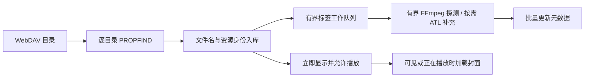

# WebDAV 接入设计方案

日期：2026-09-22。状态：首版已实施并接通实际 OpenList；第 14 节记录当前实现、验证数据和剩余兼容性边界。前文保留完整设计目标，不代表所有长期验收项目已完成。

已确认范围：兼容 NAS/普通 WebDAV 和 AList/OpenList；曲库上千首，总大小接近 100 GB。来源管理独立、音乐库统一、先文件名后标签、手动同步默认、远端只读均已确认；加入设置控制的播放时自动下载到缓存。本文中的并发、缓存额度和超时是建议初始值，不是实测性能承诺。

## 1. 推荐决策

| 问题 | 建议 |
|---|---|
| 在哪里添加地址 | 将现有“添加文件夹”升级为“音乐来源”；右上角“添加来源”包含“本地文件夹”和“WebDAV” |
| 是否单独做 WebDAV 音乐页 | 提供来源详情/远程目录浏览页，但歌曲进入同一个音乐库；不复制一整套歌曲、专辑、艺术家、收藏与播放队列页面 |
| 首次扫描方式 | 目录枚举和标签读取分离；先用文件名入库并允许播放，再后台补全标签 |
| 是否下载整库 | 不下载；自动元数据扫描禁止无界下载完整音频 |
| 元数据引擎 | FLAC 使用 ATL 7.17.0 的 Stream 入口，跳过内嵌图片；其余格式使用有界 FFmpeg/libavformat 探测，本地读取不改 |
| 封面 | 命中缓存后优先用户自有 AudioCoverReader，通过可定位网络 Stream 复用；按需加载，不在首次扫描批量拉取 |
| 播放 | 复用 AudioPlayer 的 StreamingClient；主程序增加来源解析、状态协调和凭据管理 |
| 播放缓存 | 可选边播边下载原始音频到本地磁盘；播放与下载复用传输，完整缓存可直接复用；不自动遍历下载整库 |
| 数据 | 统一 Music.Id，新增远程来源/文件详情；稳定资源身份与临时播放 URL 分开 |
| 同步 | 默认手动更新；可选启动后后台更新目录；不在启动时完整重读所有标签 |
| 第一版写操作 | 远端只读；收藏、歌单、统计、歌词偏移保存在本地 |

## 2. 已核实的现状与限制

以下是本次阅读代码得到的事实：

- `WinUIMusicPlayer.csproj` 引用 `z440.atl.core 7.17.0`。
- `View/MainPage.xaml` 已有 AddFolder 和 MusicBrowse 两个入口；`View/AddFolderPage.xaml` 已有添加按钮、来源列表和空状态，适合扩展。
- `Services/AddFolderService.cs` 通过 Directory/StorageFile 枚举和读取本地文件；`Utils/ToolUtils.cs:GetMusicInfo` 使用 `new Track(file.Path)`，不能直接承担 WebDAV 扫描。
- `Services/ScanPipeline.cs` 已有 4 个工作任务、有界结果通道、128 项批量提交，可复用设计思路，但其同步输入枚举不能直接当作异步 WebDAV 遍历器。
- `Model/Music.cs` 的 Path/FolderPath、`Services/MusicDatabaseService.Scanning.cs` 的路径归属和 NOCASE 比较，以及 `Reader/AudioCoverReader.cs` 的 File.Exists/FileStream 都有本地文件语义。
- `Services/LibraryQueries.cs` 的文件夹索引依赖 LastLevelFolderPath，同名远程目录不能继续只按末级名称区分。
- `Services/LibraryProjectionService.cs` 已统一歌曲/专辑/艺术家/文件夹/收藏投影，其查询缓存键需要加入来源条件。
- `Services/PlaybackCoordinator.cs` 当前调用播放器后就发布曲目并开始统计；网络准备时间较长，必须区分“选中待播”与“实际开始播放”。
- `Services/BassPlayerCommandService.cs` 当前通过 `IpcService.Play(music.Path)` 播放，暂停和定位也走旧入口；仅给列表加入远程 URL 不足以完成接入。
- AudioPlayer 已有 prepare/play/pause/stop/seek/refresh/status，支持 HTTP(S)、请求头、有界预缓冲、取消及失败状态。主程序还没有把上述能力纳入统一播放流程。
- 当前网络错误是 OpenOrReadFailed/ReadFailed 等粗粒度代码，不能直接据此准确区分 401、临时直链过期或服务器不可达。
- `AudioConverters/FFmpegMetadataProbe.cs` 已有 libavformat 技术字段探测，但明确只允许 file 协议、不返回 Title/Artist/Album；需要新增网络入口，不能直接复用现有入口宣称支持 URL。
- `Utils/ToolUtils.cs:GetRawImage` 已优先对 mp3/flac/m4a/wav/ogg/opus/oga 调用自有 AudioCoverReader，其他格式才用 ATL。AudioCoverReader 的内部格式解析器已接受 Stream，公共入口仍只有本地路径。

本轮只产出设计文档；没有运行真实 WebDAV 扫描或 ATL 网络读取基准，不将此前 AudioPlayer HTTP 测试等同于 WebDAV 端到端验证。

## 3. 页面与交互

### 3.1 音乐来源页

保留当前导航位置、卡片/列表样式和 MVVM，页面展示名称改为“音乐来源”。技术上的页面重命名可以后置，避免为了改名称搬动全部文件。

```text
音乐来源                                  [添加来源 ▾]
                                          本地文件夹
                                          WebDAV
本地
  D:\Music                 1,020 首          [⋯]

WebDAV
  家庭 NAS                 1,860 首          [⋯]
  已读取标签 1,230 · 待补全 630 · 最近同步 12:40
  网盘音乐                 未连接            [重新连接] [⋯]
```

来源卡片操作：浏览目录、查看歌曲、更新目录、补全歌曲信息、暂停/继续扫描、编辑连接、清理缓存、移除来源。连接状态、目录扫描状态和标签完成度分别表示，避免一个“扫描中”涵盖所有阶段。

“查看歌曲”进入现有音乐库并设置 SourceId 过滤；“浏览目录”进入来源详情，展示服务端目录树和面包屑。来源页负责管理，音乐库负责听歌。

### 3.2 添加 WebDAV

第一步填写连接信息：名称、WebDAV 根地址、用户名、密码/应用密码。“服务类型”可选自动/普通 WebDAV/AList 或 OpenList，仅用于提示和诊断，不依赖供应商私有 API 才能工作。

第二步“连接并选择目录”：用 PROPFIND 验证目录权限，显示目录树，允许选择一个或多个音乐根目录。保存地址规范化结果，保留服务端返回的真实路径；同一来源的父子根重复选择要去重。

第三步“添加并扫描”：默认快速建立目录索引并后台补标签。高级选项只保留用户能理解的项：是否后台补全、是否在启动后更新目录、扫描带宽限制；不把 Range 块大小、IPC 会话等实现参数放进普通流程。

连接测试分别报告：可列目录、抽样文件可读、可分段读取。空目录只能证明目录权限，不能宣称所有文件可播放。一个挂载的 Range 结果不能代表 AList/OpenList 下全部挂载。

第一版支持匿名和 Basic/应用密码认证。Digest、交互式 OAuth、企业单点登录应明确列为未验证/后续兼容项，不能以“所有 WebDAV”承诺支持。默认建议 HTTPS；使用 HTTP 时界面明确标识未加密。

2026-09-22 实现补充：自签名 NAS 证书可在连接窗口检查地址、主体、颁发者、有效期和 SHA-256 指纹后，显式确认并重新连接。保存来源时仅保存该 HTTPS 来源地址与具体证书指纹；允许这张有效证书的自签名/名称不匹配，不提供全局跳过校验。更换证书需重新确认，过期证书拒绝；编辑地址清除确认，忘记证书后重新测试。连接池按来源和信任状态隔离，避免借用已确认来源的 TLS 连接；其他来源和外部重定向保持系统校验，系统证书库不作修改。

### 3.3 统一音乐库

歌曲、专辑、艺术家视图上方增加来源筛选：全部/本地/WebDAV/具体来源。默认全部，记忆用户上次选择；本地用户没有 WebDAV 时不增加无意义控件。

- 远程歌曲用小型来源标识，列表和详情中可查看来源名称。
- 标签待补全：标题先用文件名，艺术家/专辑显示未知，时长显示“—”，仍可播放。
- 文件夹名只能作为辅助提示，不默认伪造为真实专辑标签；完整标签入库前不把所有未知歌曲合成一个巨大“未知专辑”。
- 补标签按批次更新；用户滚动、选中和播放中的条目不因每首回写反复跳位。完成一批后再刷新排序/分组，并保持滚动锚点。
- 来源筛选同时应用于搜索、数量统计、专辑/艺术家投影，不能只过滤歌曲列表却保留全库计数。
- 同曲本地副本和远程副本保留两个条目，不自动按标题或文件名去重；手动跨来源混合歌单正常工作。
- 同名专辑第一版至少在来源过滤内分组；来源未过滤时使用来源加专辑/艺术家上下文避免误并。更完整的发行版识别是独立需求。

### 3.4 操作能力

| 操作 | 本地歌曲 | 远程歌曲第一版 |
|---|---|---|
| 播放、收藏、加入歌单、统计 | 保持现状 | 支持，复用同一份 Music.Id |
| 标签编辑并写回文件 | 保持现状 | 禁用，并解释远端只读 |
| 在资源管理器打开 | 保持现状 | 改为打开来源中的目录 |
| 本地转码、移动/删除文件 | 保持现状 | 不直接调用现有命令 |
| 歌词偏移、手动歌词 | 保持现状 | 本地保存，按歌曲 ID 关联 |
| 播放时自动缓存 | 不适用 | 设置开关控制；只写本地缓存，不修改远端文件 |
| 清理失效曲目 | 按本地规则 | 不使用 File.Exists；按远程同步结果标记 |

“移除来源”只删除本应用的来源和关联索引，不删除 NAS/网盘文件。操作前展示影响歌曲数及歌单引用，按同一事务/协调流程清理引用和当前播放；“暂时禁用”则保留条目和收藏。

## 4. 元数据引擎选择与 ATL 的网络能力

### 4.0 支持 HTTP URL 的方案比较

| 方案 | 直接 HTTP URL | 对本项目的判断 |
|---|---|---|
| FFmpeg/libavformat + FFmpeg.AutoGen | 支持；现有网络版 DLL 已具备协议 | 首选网络探测候选，复用现有依赖；扩展现有 Probe 的网络入口和标签映射 |
| MediaInfoLib | 具备网络读取能力，依赖实际构建和 libcurl 支持 | 备选；引入另一套原生库/网络依赖，当前无充分收益支撑替换 |
| ATL 7.17.0 | Track(string) 不支持 HTTP；支持 Stream | 本地保留；远程通过自有 Range 流做字段/格式补充 |
| TagLib# | 标准文件入口不是现成 HTTP 客户端；IFileAbstraction 可接自定义流 | 换成它仍需网络流/缓存/取消适配，不能因此消除工程量 |

这里“直接支持 URL”指能自行打开 HTTP 资源，不意味着自动低流量、不意味着具备 WebDAV 目录同步，也不意味着无需处理鉴权和直链过期。封装 ffprobe 的 .NET 库通常仍需部署可执行程序；项目已有 AutoGen/DLL，第一版不为每首歌额外启动 ffprobe 进程。

推荐网络路径：WebDAV 列目录 → 有界远程 FFmpeg Probe（常用标签与音频参数）→ 针对已知缺失格式/字段按需 ATL 补充。不是对每首歌都连续扫两遍；是否启用 ATL 后备由格式策略和阶段 0 的字段一致性样本决定，fallback 共用同一首歌的总流量/时间预算。自定义标签、歌词和多值字段不能假设 FFmpeg 与 ATL 完全等价，必须保留字段来源和缺失状态。

FFmpeg Probe 读取 format.metadata 和选中 audio stream.metadata，映射 title/artist/album/album_artist/date/track/disc 等；字段优先级需固定并测例，不使用 attached_pic 的图像流覆盖音频流信息。技术字段使用 codecpar 和容器/流时长；未知值保持未知，不伪造位深或精确时长。

保留现有本地 TryProbe 契约，新增远程请求/结果类型，包括取消、失败分类、字段完整性和耗用预算。probesize/analyzeduration/max_probe_packets 只限制特定探测阶段，不是所有 HTTP 下载字节的硬上限；硬上限必须在受控传输/桥接或自定义 AVIO 层计数并截断，回退仍消耗同一预算。严格中断回调覆盖打开与探测，原生上下文只由工作线程清理。

自有封面读取仍需要可定位 Stream，所以即便 FFmpeg 成为主要标签引擎，RangeReadStream 也有直接用途，不必为避开这层而引入第二套元数据依赖。

### 4.1 确定结论

当前本地 7.17.0 包的 ATL.xml 明确说明字符串构造只支持本地路径，HTTP/FTP 不适用；同时提供 `Track(Stream, string mimeType)`。官方当前源码也显示 Stream 构造时访问 Position。

因此：不能直接 `new Track("https://...")`；也不能假设 HttpClient 返回的普通顺序响应流可直接满足解析器。可以由我们实现可读、可定位、具有正确 Length/Position 语义的流，再由 ATL 解析。传入真实扩展名如 `.flac`，避免服务端统一返回 application/octet-stream 时识别困难。

7.17.0 本地 XML 还提供 `AudioFileIO(Stream, string, bool readEmbeddedPictures, bool readAllMetaFrames)`。第一版优先通过每实例选项关闭图片和不需要的附加字段，不在并发扫描期间反复修改 ATL 全局静态 Settings。是否所有格式都会跳过图片实际字节，必须用读取轨迹测量，不能从“关闭图片加载”推导出“零图片网络流量”。

### 4.2 可定位网络流

拟新增 HttpRangeReadStream，供自有封面解析及 ATL 补充读取使用，与 FFmpeg 远程 Probe 共用传输、身份、版本和预算策略：

1. 获取文件大小与资源版本；优先复用 PROPFIND 属性，首次实际 GET 再校验。
2. 首次需要数据时请求约 128 KiB 块；Seek 只移动逻辑位置，随后 Read 命中缓存或发起对应 Range 请求。
3. 相邻读取合并，已读取块复用；实现同步 Read/Seek 以适配 ATL，在固定数量后台工作任务内调用，不在 UI 线程同步等待 HTTP。
4. 底层传递取消和请求超时；取消后等待该解析任务实际结束再释放流，不能仅用 WaitAsync 超时丢弃还在读取的解析器。
5. 只读：CanWrite=false，不允许 ATL Save 写回远端。
6. 不把头尾两段简单拼成 MemoryStream，也不为缺失字节填零伪造完整文件；两者会破坏文件偏移和解析正确性。
7. 每首受字节数、请求次数、时间三个预算约束；超限标为 Deferred，保留已经可靠读取的基础数据，不宣称标签完整。
8. 验证 206 与 Content-Range 的起止位置/总长度；Range 被忽略并返回 200 时停止自动大文件标签扫描，不静默下载整首。
9. 请求 identity 表示避免透明压缩改变偏移。缓存键包含资源身份和版本；强 ETag 优先用于条件读取，资源变化则丢弃旧块。弱 ETag、长度加修改时间只能提供较弱保障，要标记可信度。

### 4.3 格式差异

| 格式 | 网络元数据读取策略与风险 |
|---|---|
| FLAC | 通常从头部元数据块取得标签和音频属性；大 PICTURE 块需要跳过或延后 |
| MP3 | 头部 ID3v2、可能的尾部 ID3v1/APEv2；精确 VBR 时长不保证靠固定头部可得到 |
| M4A/ALAC | moov 可在文件前或后，必须支持任意偏移定位，不能假设下载前 1 MiB 一定够 |
| DSF/DFF | 标签位置可能靠后；自动标签扫描不能为了读标签下载整首，用户播放缓存另受磁盘额度约束 |
| APE/WavPack | 可能需要尾部标签/块信息，使用可定位流而非仅前缀 |
| Ogg/Opus | 标签通常靠前，精确时长可能需要末尾页，部分情况读取范围较大 |

以上是读取策略，不是“所有文件两次请求读完”的保证。必须使用项目真实格式样本验证 ATL 的读取模式。FFmpeg 作为网络主候选同样可能为探测读取很多字节；播放时已获得的时长/音频参数可以回填，但不能成为无限制后台扫描的隐性后门。

## 5. 扫描、速度和流量

### 5.1 三阶段流水线



阶段 A：用 PROPFIND Depth:1 遍历选定目录，获取 href、resourcetype、displayname、getcontentlength、getlastmodified、getetag；不依赖 Depth:infinity。只申请必要属性，解析 207 时逐项看 propstat，失败属性不等于文件不存在。标准 WebDAV 目录列表不保证包含音乐标签，也没有可假定通用可用的分页机制；单个超大目录用流式 XML 解析和有界批量入库。

阶段 B：目录枚举和元数据工作并行推进，但调度独立。先处理当前播放/可见/用户选中曲目，再处理其他待补全项目。对 NAS 默认 2 个标签任务；对 AList/OpenList 默认 1 个，验证服务稳定后可升到 2 个。目录并发默认 2，元数据全局并发上限建议 4；共享请求预算，避免多个来源叠加失控。

阶段 C：封面与歌词按需补全。遵循用户要求，顺序为“有效本地缓存 → 自有 AudioCoverReader 读取内嵌封面 → 同目录已列出的 cover.jpg/folder.jpg → 未覆盖格式的 ATL 按需回退 → 默认封面”；第三方在线搜图保持显式/已有设置控制，不在大库后台扫描自动触发。已覆盖格式读不到图片不默认再让 ATL 重扫同一文件，避免无效重复读取。

实现时给 AudioCoverReader 增加 Stream + 扩展名入口，保留当前本地路径入口；内部现有 MP3/FLAC/WAV/Ogg/MP4 解析器继续使用。当前 AIFF/APE 公共分派是注释状态，不能因为内部方法存在就宣称已支持。网络流必须可 Seek：现有 Skip 对不可定位流会逐字节读掉整个跳过区间，可能造成大流量。明确流的所有权由调用方持有，并区分“无封面”“格式不支持”“预算耗尽”“取消”“损坏”，不能把预算/取消吞成空封面后继续启动下一层请求。

图片独立预算：自动展示初始建议最多 8 MiB 实际读取，超过后保留占位图；当前解析器 30 MiB 分配保护仍作为上限，用户主动读取大封面可采用更宽预算。生成尺寸受限缩略图并限制解码后像素数；同目录共享图按资源版本复用，不能假设同专辑名必然同封面。缓存有效性改为远程 ETag/大小/修改时间，不调用 File.GetLastWriteTime(music.Path)。远程同名 .lrc 可通过目录索引按需 GET；未补齐 artist/title 前不批量触发外部歌词搜索。

播放优先于后台扫描：本来源播放打开和缓冲不足时暂停新的标签请求，恢复后低速继续；封面快速滚动时取消过时任务。UI 每 250–500 ms 或每 64–128 项合并发布，不每个网络块更新绑定。

### 5.2 初始预算建议

| 项目 | 建议初始值 | 行为 |
|---|---|---|
| Range 块 | 128 KiB | 合并相邻读取，测量后调优 |
| 普通后台标签任务 | 2 MiB / 16 个请求 / 15 秒，先达到者为准 | 超预算保留基础条目，标记需进一步读取 |
| 用户主动“深度读取信息” | 16 MiB / 64 个请求 / 60 秒 | 仍有上限，执行前展示可能流量 |
| 瞬时元数据/封面 Range 块缓存 | 单任务最多 8 MiB，全局最多 16 MiB | 全局预算优先，按需逐出；绝不按文件大小分配 |
| 持久图片缓存 | 全局 256 MiB 初始上限 | LRU，可清理；与数据库元数据分开 |
| 自动扫描完整音频下载 | 禁用 | 缺 Range 的大文件只保留基础信息 |
| 播放时完整音频缓存 | 可设置；建议默认关闭、磁盘上限 10 GiB | 开启后只补全当前播放歌曲，规则见 8.4；默认状态尚未由用户指定 |

可定位流的逻辑 Length 可以是几百 MB，但其实际内存/下载量只取决于读取预算。首次接入包含播放时音频磁盘缓存，单独显示占用与清理入口；不包含整库下载、批量离线下载或永久保留下载。扫描预算与播放缓存预算分开，开启缓存不能让后台标签扫描获得整首下载权限。

### 5.3 接近 100 GB 会不会慢

目录列表速度主要取决于目录数、服务器响应、挂载是否休眠；标签速度主要取决于歌曲数、每首实际请求次数、延迟和平均读取字节。100 GB 不是本设计的扫描下载量。

仅作量级计算，假设 2,000 首：

- 平均每首读取 128 KiB，总音频探测流量约 250 MiB。
- 平均每首读取 512 KiB，总量约 1,000 MiB。
- 如果全部碰到 2 MiB 默认上限，总量可能接近 4 GiB；预算仍需要进度展示和可暂停，不能称为“几乎不耗流量”。
- 若整库下载 100 GB，100 Mbps 理论最短约 2.2 小时，20 Mbps 约 11.1 小时，均未计协议和服务器开销，因此不采用该方式。

粗估式：T ≈ N ×（R × RTT + B / 有效单任务吞吐量 + 服务端等待）/ 有效并发度；实际还受共享总带宽约束，不能把并发倍率重复计算。示例 2,000 首、每首 3 次请求、RTT 100 ms、并发 2，仅延迟项就约 5 分钟；加入每次云盘解析/重定向等待后可能显著变长。这是说明“为什么慢”的假设计算，不是实测 ETA。

用户可见目标：目录首批结果返回后尽快显示，标签没扫完也能听；进度分别展示“已发现歌曲数”和“已读取信息/待处理/需深度读取/失败”，目录没枚举完时不显示伪精确百分比。记录实际下载字节、请求数与滚动吞吐，再给出估计剩余时间。

## 6. 增量同步与失败恢复

- 目录枚举新增歌曲；已有歌曲比较 ETag 或长度/修改时间，变化才重读标签。服务器没有可靠验证信息时按较长周期或用户手动触发重读，不假装能保证即时发现变化。
- 不依赖父目录 mtime/ETag 判断所有后代都没变化。标准 WebDAV 不等于文件监视；未来仅在检测到扩展能力后才使用同步令牌。
- ScanRunId/LastSeenGeneration 记录本次覆盖范围。只在相关目录枚举完整成功之后对其范围内的未出现条目标记 Missing；目录部分失败、401、超时、取消、断网绝不作为删除依据。
- Missing 保留 Music.Id、收藏和歌单引用，默认在普通随机播放中跳过；源离线仅标记来源状态。404 需要区分真实 DAV 路径不存在与临时直链已过期，后者重新解析来源后再判断。
- 失败项目有退避时间；401/403 停止该来源任务并提示重新认证；429 尊重 Retry-After，5xx/超时有限重试。用户取消不算错误，不循环重试。
- 重启后从数据库待处理状态继续补标签。未完整完成的目录扫描重新列举相关目录，不依赖不存在的通用 WebDAV 分页游标。
- 重扫只更新元数据字段，不覆盖收藏、播放次数、歌单顺序、歌词偏移和手工覆盖信息。
- 第一版不自动识别远端重命名为原歌曲；除非服务端提供可靠稳定资源 ID，否则采用旧项 Missing、新项新增，防止错误合并。

## 7. 数据与职责

### 7.1 建议存储模型

| 对象 | 关键数据 |
|---|---|
| Music | 保持 Id/标题/艺术家/专辑/用户数据；新增 SourceKind、MetadataState、Availability；远程 Path 不存临时 URL |
| WebDavSource | SourceId、名称、BaseUri、认证方式、CredentialKey、启用/同步策略、最近状态 |
| WebDavRoot | 来源 ID、选择的根目录 href；一个连接可选多个根目录 |
| RemoteTrack | MusicId 一对一关联、SourceId、规范化资源 href/ResourceKey、文件大小、ETag、LastModified、标签版本、最后发现代次 |
| ScanRun / ScanWork | 扫描范围/完整性、待处理阶段、重试时间、字节/请求统计；不用为每个音频块落库 |
| RemoteAudioCacheEntry | SourceId/ResourceId、源版本及可信度、缓存根代次、本地内部路径、Partial/Complete 状态、有效区间、占用/预留字节、最近访问与校验时间；租约只在运行中持有 |
| 播放描述符 | 临时 URL、临时 Headers、有效期、CanSeek；仅内存存在，不作为曲目主键 |

保留现有 Music.Id 可避免复制收藏/歌单/历史系统；远程专有字段放扩展表而非为每个本地条目增加大量空列。迁移后旧 Music 默认 LocalFile，所有本地路径查询、存在性检查、监视器、外部导入归属及写标签逻辑明确加来源限定；远程 Path 留空也不能导致本地查重将所有远程项合为一个。

远程唯一键为 SourceId + 规范化资源标识，按大小写敏感规则保存路径；不能套用 Windows OrdinalIgnoreCase/NOCASE。BaseUri 的主机规范化与路径规范化分开处理；保留服务端有效百分号编码语义，不双重解码，不把编码斜杠误作目录分隔，不擅自合并 Unicode 等价名字。目录根约束按 URI 路径段判断。

凭据用 Windows 凭据存储，数据库只放关联键；相同服务器不同账号是不同来源。日志不记录 Authorization、密码、完整签名查询串。导出/备份默认不携带凭据和临时直链。

### 7.2 服务边界

- WebDavClient：PROPFIND、GET/Range、URI、鉴权、重定向、错误分类与响应释放。
- RemoteReadCoordinator：按资源版本协调前台读取与缓存补全，合并在途相同区间，管理传输并发/优先级/背压；不持有 UI 对象。
- RemoteAudioCacheService：磁盘额度、缓存索引、有效区间、完整提交、读取租约和逐出；不自行创建另一套 HTTP 下载通道。
- RemoteLibrarySyncService：目录同步、任务调度、重试、批量数据库提交；生命周期由启动/退出协调器显式管理。
- RemoteMetadataReader：以有界 FFmpeg Probe 为网络主候选、可定位流 + ATL 为按需补充，只返回元数据结果/读取状态，不直接修改 UI。
- PlaybackSourceResolver：从 Music.Id/来源解析当次可播放描述符，不管理歌曲列表。
- PlaybackCoordinator / 播放适配层：统一选曲、准备、明确 Play/Pause 意图、会话替换和状态发布；不为 WebDAV 建第二套全局播放状态。
- Cover/Lyrics 服务：按来源分派读取，并复用现有缓存/展示流程。
- 页面 ViewModel：持有连接表单、来源展示及命令；View 仅布局和事件转发。

本地 LibraryOperationGate 不能被几分钟网络扫描长期占用。来源有独立扫描任务，数据库短事务串行提交；全局数据迁移/清库仍有协调屏障。后台结果携带来源版本/任务代次，来源被修改/移除后迟到结果不得重新入库。

## 8. NAS 与 AList/OpenList 的播放接入

### 8.1 资源身份与临时地址

ResourceId 使用稳定的远程记录 ID；SourceId/href 是重新解析入口。AList/OpenList 的 302 目标通常是一次性或临时直链，不能永久保存为 Music.Path，也不能当作扫描差异比较的依据。不同挂载的重定向/Range 能力分别检测，失败不能永久污染整个服务器的能力缓存。

### 8.2 鉴权和重定向的推荐边界

元数据和目录走主程序统一 HTTP 传输层；关闭不受控的自动转发鉴权头，限制重定向次数，跨源重定向移除源服务器凭据，同源凭据也受来源配置约束，不自动接受 HTTPS 降级。

已有 AudioPlayer 会把描述符中的自定义 headers 交给 FFmpeg；现有测试没有覆盖“携带 Authorization 时跨域 302”的凭据隔离。因此不能直接宣称把 NAS 账号头交给 FFmpeg 就完成兼容。

建议第一版：WebDAV 播放统一经过受控本机只读 HTTP 桥接。AudioPlayer 取得带随机会话令牌的 loopback URL，主程序桥接负责上游鉴权/重定向并流式转发 GET/Range。桥接不解码，缓冲有界；开启自动缓存时由共用读取协调器同时写入磁盘，关闭时仅按播放需要供数。这样播放、缓存和元数据使用同一套 HTTP 身份边界。无鉴权且关闭缓存时的可信最终直链，可作为后续优化，不阻塞第一版。

桥接必须：只绑定 loopback、令牌限定单个资源且可撤销、只允许 GET/HEAD、禁止任意 URL 参数代理、限制连接数/请求头大小、正确转发 206/200/416/长度、资源版本一致性检查、在播放器停止时取消上游请求并释放连接；应用退出先停播放器会话，再释放桥接和 HTTP 客户端。请求期间所有权明确，不能等待端口关闭就当作上游下载已停止。

这是新增工程量，但对于同时兼容鉴权 NAS 和云盘 302，边界比到处手工拼 Authorization 更清楚。它不等于 OpenList 服务端的“本机代理”设置；后者是远端部署策略，本方案桥接运行在播放器电脑上。

### 8.3 播放状态与现有系统

```text
选择歌曲 → Resolving → Preparing → Buffering → Playing
                               ↘ Paused（用户意图优先）
Playing → Buffering → Playing / Paused / Failed / Ended
```

- 主程序持有一个当前播放请求代次和 AudioPlayer SessionId；A→B 快速切歌后，A 的迟到准备/状态不得覆盖 B。
- 所有页面、快捷键、系统媒体键使用同一命令路由。远程打开中 Pause 必须保留，不能被准备完成覆盖。
- 提前更新待播标题可以，但统计累计以实际 Playing 和有效进度为准；缓冲、失败和暂停不计听歌时间。
- 远程状态由当前 SessionId 的 status 驱动；进度邮箱只在会话匹配时使用。旧 PlayEnded 通知没有 SessionId，网络播放阶段应避免同时由旧通知和新状态双重触发下一首；必要时扩展协议携带会话/代次。
- 第一版不强制跨曲预加载：现有播放器最多两个槽位，先保证选曲/取消/混合队列正确；后续最多预准备下一首，用户切歌优先清理旧预加载。
- 当前接口没有可直接用于精准鉴权续期的 HTTP 错误码。桥接返回结构化的主程序错误，或扩展 StreamReply 的可选错误分类/Retryable/源错误字段并做能力协商，不能解析日志文案判断 401。
- 临时地址过期：重新解析原 DAV 资源，有限重试；重开时使用 refresh 保留位置和 WantsPlay。无 Range 或实体版本已变时不能假装从旧位置继续；提示重新从头播放。
- 网络失败默认保留当前曲目并提供重试，不按自然 EOF 自动跳到下一首，防止账号过期时跳完整个歌单。
- 无 Range 的文件按格式尽力顺序播放，不保证所有容器都能起播；定位按钮禁用并解释原因。

### 8.4 播放时自动缓存

#### 用户可见行为

关于页保留“播放 WebDAV 歌曲时自动缓存”、容量上限、已用空间和音频清理按钮；目录统一由原来的缓存位置设置管理，WebDAV 卡片仅展示实际子目录。沿用 MVVM，开关和数值输入同一行，不给横向 ToggleSwitch 添加 Header。当前默认关闭、上限 10 GiB。按用户确认，原始音频放在配置根目录的 `WebDav/Audio`，远程原图放在 `WebDav/Covers`，所有来源的缩略图继续共用 `Cache`。音频和封面的清理/容量仍分开，清封面不删除下载音频。

开启后的目标是边播放边补全当前歌曲的**原始音频文件**。不仅保存听到的片段，也不先等整首下载再开始播放。下载完成、通过完整性条件的缓存可供后续播放和元数据读取；缓存文件不单独导入音乐库，收藏/播放历史仍归原 Music.Id。UI 以“未缓存 / 缓存中 / 已缓存 / 缓存失败”表达，缓存失败不替代播放状态。

自动缓存属于可逐出的临时存储，不保证用户快速跳过的每首歌都完整下载。完整缓存可在来源暂时离线时播放，并提示“使用缓存”；永久保留、批量下载和独立离线库作为后续功能。来源删除后的缓存按租约清理，不留下另一份隐式音乐库。

#### 数据路径与下载去重


同一资源、同一版本、同一区间共用在途读取；不能让 FFmpeg 下载一遍、后台下载器再从头下载一遍。缓存关闭时只提供播放所需数据和有界预读。开启时前台请求优先，空闲带宽用于补缺失区间，全局最多一个补全任务；默认不下载下一首。统计实际网络字节与唯一覆盖字节，区分正常重试、版本变化、寻址重读与可避免的重复下载。

下载去重与取消分开处理：单个等待者取消只释放自己的需求，仍有播放器读取的上游任务不能随补全开关一起取消；最后一个需求释放后才终止相应读取。不同消费方通过有界缓冲或已经写好的缓存区间共享结果，慢消费者不得长期占住前台缓冲。

传输缓冲初始建议 64 KiB，使用有限数量的复用缓冲；这不是每次 HTTP 请求的大小。元数据按 128 KiB 逻辑块读取，播放可合并为约 1 MiB 的连续 Range 窗口，收到首批数据即交给播放器，不等整个窗口填满；窗口大小须按 RTT/吞吐实测调优。顺序流可在预算允许时延长读取，避免每 64 KiB 新建一个请求。

前台数据不等待磁盘落盘后才返回。写盘队列建议全局最多 2 MiB，计入传输内存预算；慢盘/满盘导致队列无法接收时，停止当前资源的缓存补全并降级为纯播放，不堆积无界内存。缓冲跨“发送”和“写盘”时明确引用/所有权，两个使用方结束后才能复用；实现优先清晰的有界复制，不为追求零复制增加不可靠的资源共用。已写入但未持久确认的区间不能误标为完整。

#### 部分文件与版本一致性

- 使用 `.part` 文件和有效区间记录。只向播放器返回已经写好或实际取回的数据，不能依赖文件逻辑长度、预分配或稀疏文件中的零填充判断完成；不把未完成文件路径直接交给播放器。
- 同一缓存版本需要完整覆盖 `[0, Length)`，核对响应范围/长度及版本，完成写入和关闭后在同一卷内原子改名，再更新索引。崩溃恢复处理“文件已改名但索引未提交”等中间状态；不完整/无法验证的记录保持 Partial 或丢弃。
- 长度未知时只允许单次顺序响应；仅在 HTTP 层确认消息完整结束后确定最终长度并提交。无法区分正常结束和截断的响应不标为 Complete。
- 强 ETag 或等价可靠版本用于多次范围读取的一致性校验；ETag 不是内容哈希。`If-Range` 验证失败回到 200 时不能将整文件响应写入旧区间。参见 [HTTP 条件范围读取](https://www.rfc-editor.org/rfc/rfc9110.html#section-13.1.5)。
- 只有弱 ETag/长度+时间、或者没有验证器时，第一版采取保守策略：允许同一个从头到尾完整 GET 的结果成为缓存，不跨响应/跨进程重启拼接旧部分文件。跳转导致多个响应时不承诺补全成功，也不为兑现缓存而另启动整首重复下载。UI 标识此来源缓存能力受限。
- 服务端不支持 Range 时可顺序播放并顺路缓存；不能为了封面/标签或补洞自动丢弃几百 MB 的前缀。已完整缓存的文件在当前播放器格式支持范围内可以本地定位。
- 缓存命中也先通过本机桥接提供，维持现有 HTTP 播放解码路径；暂不自动改走本地路径入口，避免缓存命中意外启用不同的 DSD/Atmos/响度分析逻辑。完整文件可供标签/封面服务按本地文件读取，但保持远程资源身份。
- 在线复用缓存时按源版本、最近校验时间和当前同步结果检查；离线使用标明最后缓存/校验时间。无可靠验证器时不宣称自动保证最新，提供重新获取入口。

#### 开关、额度与清理

| 场景 | 行为 |
|---|---|
| 开启开关 | 对当前播放资源启用写盘/补全；缺失前缀仅在能确保版本一致时补读 |
| 关闭开关 | 停止低优先级补全及新写盘，完成/取消已在途写操作；当前播放继续，已有完整缓存仍可读取；清理是独立操作 |
| 暂停 / 定位 | 暂停不继续主动补全；定位请求优先，撤销冲突的低优先级读，不丢失 Play/Pause 意图 |
| 切歌 / 停止 / 播放结束 | 停止旧曲补全并收尾在途写盘，不形成“听过的歌”后台下载队列；Partial 计入额度，建议最多保留 24 小时 |
| 单文件超过额度 / 剩余空间不足 | 跳过缓存，继续在线播放并显示原因；不因缓存失败导致起播失败 |
| 清理缓存 | 停止补全，逐出未被读取的文件；当前播放持有租约的文件在释放后清理，不截断其正在使用的文件 |
| 修改缓存位置 | 新任务使用新位置，旧读取租约完成后清理；不在 UI 线程搬运整个缓存目录 |

额度按“已完成 + 部分文件 + 在途预留”统一计账。已知大小时预留容量但不在起播前同步预分配全文件；大小未知时增量预留，到限就停止缓存。默认还建议保留至少 2 GiB 可用磁盘空间。优先逐出过期部分文件，再按最近使用逐出无租约的完整文件；无法腾出空间就降级。缩小额度时占用中的文件可暂时超额，显示待清理，禁止继续扩大缓存。

指定目录须创建应用专用子目录，清理只处理缓存索引确认归属的文件，不递归删除用户音乐目录。目录不可写、外置盘断开、文件被占用或杀毒软件延迟都属于缓存失败，不属于来源失效。完整提交时持久化即可，不逐 64 KiB 强制刷盘；崩溃安全与磁盘吞吐一起验证。

## 9. 整体性能、内存与回收评估

### 9.1 结论与成本分布

这套方案适合当前“上千首、接近 100 GB”的规模：应用内存随并发、缓冲、图片和歌曲索引增长，不随远程音频总容量增长。自动缓存主要增加磁盘写入、系统文件缓存及部分提前下载流量；最大的新增风险是扫描/补全争抢播放带宽、图片解码峰值和取消不完整造成旧任务长期保留。

以下是基于代码和预算的设计评估，尚无 WebDAV 实现的运行基准，不能据此承诺具体 CPU 占用、GC 次数或起播时间。

| 环节 | 主要开销 | 约束与预期影响 |
|---|---|---|
| 目录枚举 | RTT、服务端目录构建、XML/路径字符串、数据库写入 | 流式解析、目录并发 2、有界批量；全量刷新为目录/条目级遍历，不读取 100 GB 内容 |
| 标签扫描 | 网络请求、少量探测 CPU、短期对象及 Range 块 | NAS 2 / 云盘 1，全局最多 4；受全局块内存预算约束，不逐首起进程 |
| 在线播放 | TLS、桥接复制、原生解码和 PCM 缓冲 | 前台优先，低缓冲时暂停新扫描/补全；稳定供数比细小对象微优化更重要 |
| 自动缓存 | 原始文件磁盘写入、下载补缺和索引 | 同一传输复用，内存有界；已听完整且无额外重读时无需第二遍全文件流量 |
| 缓存命中 | 磁盘读取及本机桥接 | 可减少远程访问与起播等待；解码/DSP 成本仍存在，实际延迟需实测 |
| 封面展示 | 压缩图片读取、解码、WinRT/纹理内存 | 自有读取优先、按需、限像素和并发，不能只限制图片文件字节 |
| 库列表更新 | 对象保留、分组/排序和 XAML 布局 | 复用条目、来源过滤纳入查询键、按批发布与虚拟化，避免每首重建全库 |

播放请求/定位具有最高优先级；当前封面采用小预算按需读取；补全和扫描均可暂停，使用有限队列公平调度，不能让整首补全长期饿死目录显示。慢网络和缓冲不足时先停补全、再暂停新标签请求；恢复后渐进放开，避免频繁反复启动。不同来源也共享全局连接/内存上限；仅设置每个 HttpClient 的连接数并不等于整个应用有上限。

初始建议全局上游活动请求最多 8 个，后台任务合计最多占用 6 个，为播放/定位保留容量；目录、标签、封面与补全还要遵守各自更小的并发上限，不能将每类额度简单相加。同步解析器使用有限工作任务，禁止在 UI 线程等待，也避免把线程池大量阻塞在同步网络 Read 上；前台桥接采用真正异步供数。

### 9.2 网络与磁盘的量级

自动缓存写的是压缩文件或容器原始字节，不写解码后的 PCM。举例，50 MiB 的歌曲完整缓存约增加 50 MiB 文件内容写入；实际物理写入还受文件系统、索引和存储设备影响。正常完整播放、单版本、无重试且请求去重成功时，缓存不会额外下载第二份 50 MiB；如果只听几秒就切歌，提前补全可能已经多取一些数据，因此要取消旧曲补全并展示实际流量。

10 GiB 额度约容纳 204 首 50 MiB 歌曲，或者 102 首 100 MiB 歌曲，只是容量示例。接近 100 GB 的曲库无需全部落盘。高速补全可能短时达到磁盘/网络上限，不能用平均音频码率推断没有竞争；缓存限速、暂停策略与慢盘降级要通过混合负载验证。

### 9.3 主程序新增内存预算

| 项目 | 建议约束 | 口径 |
|---|---|---|
| 元数据/封面可定位流的块缓存 | 全局 16 MiB；单任务不超过 8 MiB | 活跃与待复用块按实际容量统一计账；不能给 4 个任务各留 8 MiB 后仍声称全局 16 MiB |
| 应用自有传输和写盘缓冲 | 全局 4 MiB，其中待写队列最多 2 MiB | 覆盖并发请求与迟到清理占用，资源未归还前不能重复发放预算 |
| 自动封面编码字节 | 全局单个最大 8 MiB，至多一个大图读取/解码任务 | 读预算之外，还要在按图片头长度分配前拒绝过大图片；已有 30 MiB 防护不能代替网络模式预算 |
| 解码后封面/缩略图 | 初始按估算像素字节全局 32 MiB 管理展示缓存 | 不等于 WinRT/GPU 的实际总上限；限制单图尺寸与副本，需原生内存实测 |
| XML、数据库批次与 UI 通知 | 流式 XML，64–128 条一批，通知每 250–500 ms 合并 | 超大单目录也不能整体构建 XML DOM 或为全库创建 Task 列表 |
| 曲目对象、索引和任务状态 | 按歌曲数/目录数增长；后台队列有界、待办持久化 | 现有统一库已有驻留成本，实测每千首增量；不把封面 byte[] 挂在所有 Music 上 |

前 3 项应用持有的原始字节预算合计约 28 MiB，是待实现的预算目标；它不包含解析器内部对象/副本、HttpClient/TLS、图像解码、数据库、UI、播放器进程，也不等于整个主程序的内存增量上限。若使用 ArrayPool.Shared，已归还数组可能继续由共享池保留；需要严格约束池保留量时使用数量/容量受控的专用缓冲管理，并计算闲置缓冲，不能只计算借出的内存。

4000 × 4000 的四字节像素单副本约 61 MiB，而压缩后的封面可能只有几 MiB。应先检查图片尺寸、按实际展示尺寸解码并限制缓存；原图 byte[]、解码位图、调色板分析和 GPU 上传同时存在时要计算峰值。用户主动深度读取大封面使用独立且有限预算，不挤占播放通道。

### 9.4 AudioPlayer 已有缓冲的实际容量

`External/BassPlayerIpc.Shared/Streaming.cs` 默认预缓冲 1.5 秒、恢复阈值 2.5 秒、容量 8 秒。`External/AudioPlayer/Playback/Session.cs` 为 HTTP PCM 使用 double 数组，容量按采样率与声道数计算，每个会话的 PCM 环形缓冲最多 64 MiB。初始预缓冲阈值不等于只分配 1.5 秒的容量。

在环形缓冲实际使用下列采样率、双声道且默认 8 秒时，计算为 `采样率 × 8 × 2 × 8 字节`：

| 环形缓冲采样率 | 单会话 PCM 容量 | 两个同时存活会话的容量 |
|---|---|---|
| 44.1 kHz | 5.38 MiB | 10.77 MiB |
| 48 kHz | 5.86 MiB | 11.72 MiB |
| 96 kHz | 11.72 MiB | 23.44 MiB |
| 192 kHz | 23.44 MiB | 46.88 MiB |
| 384 kHz | 46.88 MiB | 93.75 MiB |

实际按解码/输出路径使用的 rate 计算，不能只看文件标称采样率。每会话还存在 `16384 × 声道数` 个 double 的解码暂存，双声道约 0.25 MiB，以及 FFmpeg、DSP 和设备缓冲。64 MiB 是单个环形缓冲上限，两个槽位仅这一项就可能达到 128 MiB；不是播放器进程总上限。

这些大数组已在当前网络播放实现中存在，WebDAV 缓存不会按磁盘文件大小再创建一份 PCM。切歌/预准备仍会产生大对象替换；必须验证旧会话线程、回调和引用及时释放。第一版先保持有限会话与正确释放，不盲目池化多个最大规格环形缓冲。

### 9.5 分配、GC 和既有代码的交互

主程序与 AudioPlayer 有各自的托管堆；某个进程的 GC 不直接暂停另一个进程。但主程序若暂停供给桥接数据，播放器会消耗已有缓冲，因此主程序 STW、UI 阻塞或线程池饥饿依然可能间接造成音频欠载。

默认 LOH 阈值约 85,000 字节，128 KiB 块、PCM 数组和较大封面会进入大对象区。重点是减少高频大对象替换、避免多次 ToArray/MemoryStream 复制并约束保留量；长寿命有界缓冲可以接受。Http 请求/响应、TLS、解析器和任务仍有分配，方案不承诺零分配。[.NET LOH 说明](https://learn.microsoft.com/en-us/dotnet/standard/garbage-collection/large-object-heap)

检查 HTTP 请求/响应/流、CancellationTokenSource、计时器和事件订阅在成功、失败、取消路径中的释放。使用 ResponseHeadersRead 避免默认整体缓冲时，还要独立控制响应体读取的空闲超时/取消；HttpClient.Timeout 不会自动覆盖整个响应体读取阶段。[HttpCompletionOption 官方说明](https://learn.microsoft.com/en-us/dotnet/api/system.net.http.httpcompletionoption)

响应体空闲超时只衡量已发起读取却没有数据的等待，应用主动暂停、背压或调度让出的时间不能误算成服务器无响应；请求总时限、活动读取超时与播放会话取消分别管理。普通标签任务仍受端到端时间预算约束，不能靠反复让出无限延长。

当前 `MusicBrowseViewModel.OnTrackStarted → TrimMemory → WorkingSetCompressor.TrimSelfAsync` 存在可选清理路径：开启该设置且主程序私有工作集超过 400 MiB 时，尝试 GC、等待终结器并压缩工作集。这是已有行为，不能作为新缓存的内存管理策略。新增缓冲可能更容易触及阈值；即便放在 Task.Run，GC/缺页影响仍可能传播到 UI 和桥接。实现阶段单独对比该开关开/关，不直接提高阈值掩盖保留，也不在本轮设计中擅自改默认值。

诊断不把 `GCEnd - GCStart` 当 STW；使用运行时暂停事件并与 UI/欠载时间线对齐。分别记录分配速率、自然 GC 后保留量、暂停最大值/分布和原生资源，不能仅用平均 GC 时间或工作集下降证明成功。[运行时 GC 事件](https://learn.microsoft.com/en-us/dotnet/fundamentals/diagnostics/runtime-garbage-collection-events)

### 9.6 生命周期与退出顺序

服务构造函数只保存依赖；应用启动后显式启动，来源无待办时不轮询全库。复用 ApplicationTasks 的跟踪思路，通过 ShutdownCoordinator 注册完整 stop 操作；不要把网络服务绑在页面 Loaded/Unloaded 的偶然时机。

退出/删除来源时依次阻止新工作，撤销播放/预备会话，取消上游读取和补全，等待解析/写盘实际结束，然后保存安全的索引状态，释放桥接、响应、文件、缓冲与共享 HTTP/数据库依赖。取消等待超时不能提前释放仍被线程或原生回调使用的资源；无法及时结束的操作保留所有权至真正结束，并记录问题，不将半文件标为完整。应用退出不等待整首下载完成，只等待取消与收尾。

切歌时同样以 SessionId/来源代次隔离迟到结果；可保留完整缓存，但不保留引用了旧页面/曲目/大图的后台任务。关闭缓存功能时停止其实际下载/写盘活动，不能只隐藏进度。

### 9.7 实测方案与通过依据

以同一组本地/远程样本做对照，分开记录主程序和 AudioPlayer；至少覆盖 2,000 首模拟或实际索引、近 100 GB 文件规模特征、FLAC/MP3/M4A/DSF 等实际样本。模拟服务用于确定失败与时序，真实 NAS 与 AList/OpenList 用于证明兼容与实际延迟。

| 场景 | 重点验证 |
|---|---|
| 缓存关闭 / 开启冷缓存 / 完整热缓存 | 起播和定位的中位数/尾延迟、实际网络字节、磁盘读写、分配速率；同条件比较，不能混用冷暖缓存 |
| 后台扫描 + 播放 + 封面切换 + 补全 | UI 响应、音频欠载、队列峰值、请求去重，前台能否及时抢占 |
| 48/192/384 kHz、双会话、连续快速切歌 100 次 | PCM 与图像峰值、旧会话数量、在途请求/CTS/句柄是否收敛 |
| 低带宽/高 RTT、慢盘/满盘/缓存目录断开 | 补全及时退让，缓存失败不破坏可正常供数的在线播放 |
| Range 异常、弱/无 ETag、源文件被替换、响应中断 | 不混合版本，不误报完整，流量受限，Partial 恢复规则正确 |
| 关闭开关、暂停、清理、改路径、移除来源、退出 | 无继续补全，无归还后仍使用的缓冲，无迟到 UI/数据库回写 |
| 30 分钟混合负载与更长重复运行 | 自然 GC 后保留量/原生句柄趋势、池高水位、数据库与磁盘额度；区分有界缓存和持续泄漏 |

记录操作次数与采集窗口，输出 UI/音频时间线、请求与唯一字节量、队列深度、CPU、GC 暂停样本数及最大值/分位数、LOH/存活量、私有提交/工作集和句柄。没有足够暂停样本时不制造精确 p99；硬缺页、原生/GPU 增长需要独立证据。

当前 AudioPlayer 发布配置 `PublishAot=true`、`EventSourceSupport=false`。若需 EventPipe，制作单独诊断发布并核对实际支持的事件；普通 build 的 CoreCLR 结果不能替代生产 AOT 结果，诊断开启本身也要做对照。[NativeAOT 诊断能力](https://learn.microsoft.com/en-us/dotnet/core/deploying/native-aot/diagnostics)

通过依据是：设置与代码的并发/内存/磁盘上限可验证；控制条件下播放没有因后台工作新增的可复现欠载；取消后任务和资源收敛；重复场景没有无法解释的持续保留；缓存关闭无补全流量，正常单版本补全没有可避免的重复整首下载。具体延迟与 GC 目标在阶段 0 基线出来后确定，不先写一个脱离设备/服务器的绝对阈值。

## 10. 分阶段交付

### 阶段 0：技术验证先行

选取覆盖 FLAC/MP3/M4A/DSF/APE/WavPack/Ogg 的小样本，包含头部/尾部标签、大封面、VBR；在 NAS 与 AList/OpenList 上分别记录 FFmpeg 和 ATL 每首读取字节、请求偏移/次数、耗时、取消延迟与字段完整度，确认网络主引擎和格式级回退策略。单独验证自有 AudioCoverReader 的封面字节与本地结果一致。验证预算终止不会留下半完整数据被误标成功。并测试鉴权/302/Range 桥接与现有 NativeAOT 播放器。

同时验证“播放 + 共用传输写盘 + 低优先级补全”的最小路径：记录是否重复读取、起播/定位是否等待写盘、慢盘与取消是否正确降级、弱/无验证器是否遵守保守规则，并取得第 9 节性能基线。

交付的是可量化结论：普通标签是否多数落在默认预算内、哪些格式需降级；不能预先承诺 100 GB 曲库几分钟完成。

### 阶段 1：最小完整体验

音乐来源页、添加/测试/选目录、文件名快速入库、稳定资源身份、统一音乐库来源过滤、远程顺序播放/暂停/定位/混合歌单、凭据保存、错误与离线状态；包含可关闭的播放时缓存、容量/位置设置、Partial/Complete 管理、完整缓存复用和清理。标签未完成不阻塞起播。加入完整退出清理与数据库迁移回归。

### 阶段 2：元数据与增量同步

有界远程 FFmpeg 探测与 ATL 按需补充、后台补标签、自有封面解析的 Stream 适配、封面/歌词按需缓存、ETag 增量、断点恢复、缺失标记与扫描流量进度。这一阶段完成后作为面向上千首曲库的首个正式版本。

### 后续增强

用户主动深度读取、可配置扫描限速、下一曲预缓冲、可验证的直链优化、可永久保留的批量离线下载、特定服务器同步扩展。播放时自动缓存已经包含在阶段 1，不延后到这些增强项。远端标签写回、文件删除/移动、OAuth、CUE 多轨等分别立项，不塞进首次接入。

## 11. 验收标准

- 真实 NAS/普通 WebDAV 至少一个实现，AList/OpenList 至少覆盖直返和 302 两种策略；不能只用本地 HttpListener 证明兼容。
- 上千首目录：首批内容可见且可点击播放；不等待全库标签读取，UI 无同步网络阻塞。
- 扫描实际下载字节与预算一致；大文件/大封面不会触发整库下载，取消后没有持续后台流量。
- 版本未变化的二次扫描不重新读取其音频标签；没有可靠版本信息时降级规则可观察。
- Range 被忽略、错误 Content-Range、416、资源在分段读取间变化、无 Content-Length、缺 ETag 都有可复现用例。
- 中文、空格、#、%、大小写不同名称、尾斜杠、绝对/相对 href、同名目录不误合并、不越过选定根。
- 401/403/429/5xx、TLS 错误、休眠 NAS、断网/恢复、目录部分失败不会删除库记录。
- AList/OpenList 直链过期可以重新解析；跨主机 302 不携带源 WebDAV 密码，loopback URL 不允许访问任意资源。
- 快速切歌、打开期间暂停/停止、定位后立即播放、本地与远程切换、来源删除与应用退出没有迟到状态覆盖、重复下一曲或资源泄漏。
- 自动缓存开启不等待完整下载才起播，不产生可避免的第二遍整首下载；关闭/切歌后停止补全，缓存写盘失败可独立降级。
- 磁盘限额覆盖已完成/部分/预留容量；缓存清理与修改位置不破坏当前读取，崩溃和版本变化不能把部分文件当完整文件。
- 第 9 节混合负载、缓冲预算、图像峰值、自然 GC 后保留量和 AOT 诊断限制有明确验证记录；无实测数据不宣称性能达标。
- 收藏/歌单/统计使用同一 Music.Id；未补标签时长不显示为真实 0 秒；元数据回写不覆盖用户数据。
- 所有新增本地化 GetString 使用独立资源键并覆盖六种语言；保持现有 MVVM 与 UI 布局约定。

## 12. 已确认决策与建议参数

已确认：

1. 音乐来源管理独立、听歌列表统一。
2. 初扫先显示文件名、后台补标签，自有封面读取方法优先。
3. 远端保持只读；增加设置控制的播放时自动下载到本地缓存。
4. 默认手动更新目录，启动自动更新作为可选项。

实施默认值：自动缓存关闭、10 GiB 磁盘额度、至少保留 2 GiB 可用空间；缓存自动逐出，第一版不提供永久保留或整库下载。这些是执行时采用的建议初始值；用户可在“设置 → 关于 → WebDAV 播放缓存”展开卡片修改。

## 13. 依据与核实边界

- 项目本地 NuGet 包：`C:/Users/90684/.nuget/packages/z440.atl.core/7.17.0/lib/net6.0/ATL.xml`，Track 构造文档及 AudioFileIO 实例选项；包 nuspec 标记源码 commit `6751eb15057f277a800996e8c7c03ed4b6858389`。本轮未成功从网站取得该固定 commit 源文件，7.17.0 结论以本地包 API 文档为依据。
- [ATL 官方 Track 源码](https://github.com/Zeugma440/atldotnet/blob/main/ATL/Entities/Track.cs)：当前主线公开实现作为补充，不能替代固定版本实测。
- [WebDAV RFC 4918](https://www.rfc-editor.org/rfc/rfc4918.html#section-9.1)：PROPFIND/Depth/属性及多状态响应。
- [HTTP RFC 9110 Range](https://www.rfc-editor.org/rfc/rfc9110.html#section-14.2)：服务器可能忽略 Range，应验证实际响应。
- [OpenList WebDAV 策略](https://doc.oplist.org/guide/drivers/common#webdav-policy)：区分 302、代理 URL 与远端本机代理。产品差异按运行时响应检测，不写死供应商行为。
- [FFmpeg 官方 ffprobe 文档](https://ffmpeg.org/ffprobe.html)：URL 输入、format/stream 元数据；本文建议直接用对应 libavformat API，不新增 CLI 依赖。
- [FFmpeg HTTP 协议](https://ffmpeg.org/ffmpeg-protocols.html#http)、[探测参数](https://ffmpeg.org/ffmpeg-formats.html#Format-Options)：网络与探测控制仍需应用层预算。
- [TagLib# 官方 File.cs](https://github.com/mono/taglib-sharp/blob/main/src/TaglibSharp/File.cs)：IFileAbstraction/ReadStream 适配边界。
- [MediaInfo 官方输入类型介绍](https://mediaarea.net/Events/PDF/2016-07-18_Symposium.pdf)、[当前构建说明](https://github.com/MediaArea/MediaInfo)：具备 HTTP/HTTPS 输入路线，实际分发构建及 Curl 依赖需要单独确认，本轮未验证其二进制。

本轮额外核对了 Session/Streaming 的 PCM 容量计算、AudioPlayer 的 AOT 诊断配置、WorkingSetCompressor 的可选清理调用链，以及 ShutdownCoordinator 的停机顺序；第 9 节包含计算和代码事实，不是运行测量。GC/NativeAOT/HTTP 的官方依据已就近链接。

页面安排与远端只读等方向按第 12 节记录为已确认；缓存额度、并发、读取预算及具体桥接实现的当前取值见第 14 节。真实服务与性能结论仅适用于已执行的场景。

## 14. 首版实现与验证记录

### 14.1 实际入口与行为

- **音乐来源**：一个页面标题和“添加来源”菜单，选择本地文件夹或 WebDAV；两类来源使用一致的卡片、图标和操作间距。WebDAV 可查看歌曲、浏览目录、更新、暂停扫描、编辑、移除。
- **音乐库**：保留统一歌曲、收藏、歌单与分组详情。来源筛选支持全部、本地、WebDAV 和具体来源；四类歌曲列表增加固定宽度图标列，文件夹图标表示本地、云图标表示 WebDAV。图标绑定只读取曲目属性，不触发数据库或网络请求。
- **播放栏**：云图标与左下角音频格式、HQ 同行，悬停显示当前连接/播放状态；进度条同行只保留进度与时间。
- **设置**：关于页默认折叠的“WebDAV 播放缓存”卡片包含自动缓存开关、GiB 上限、实际路径、占用和清理。路径只读，统一通过原有缓存位置入口修改。无独立缓存设置分类。
- **连接**：先验证 PROPFIND，再保存凭据到 Windows PasswordVault。数据库不存密码。支持匿名/Basic；跨来源重定向不携带原始凭据，禁止 HTTPS 降级。测试地址与密码不写入源码和文档。
- **扫描**：先按 64 首批次提交目录记录，随后补标签；标签每 16 首批量发布 UI。手动更新会重试暂缓项，未变化且完成的记录跳过标签探测。只在目录或来源枚举确实完成后标记缺失，失败不删除索引。
- **只读**：禁止远程标签/封面写回、转码和 USB 文件导出；收藏、歌单、播放统计与歌词偏移继续本地保存。同名专辑按来源区分，避免本地编辑误及远程曲目。

### 14.2 网络元数据与自研封面读取

实际 OpenList 暴露 224 个音频文件。初始 FFmpeg 路径有 4 个 FLAC 因大封面触及读取预算而暂缓。改用 `ATL.Track(Stream, ".flac")` 后，不访问懒加载的 `EmbeddedPictures`，这 224 首元数据全部成功。同步解析始终在受限后台任务中运行，流记录预算/取消异常，防止解析器吞异常后误报成功。

| 实际样本 | 标签读取音频字节 | 自研封面大小 / 读取音频字节 |
|---|---:|---:|
| Moog Pluck（FLAC） | 262,144 | 315,403 / 393,216 |
| Phantom Liberty（MP3） | 131,072 | 30,201 / 131,072 |
| INFECTED（FLAC，大内嵌封面） | 262,144 | 2,053,295 / 2,097,152 |

封面仍先走原有 `AudioCoverReader`，通过新增可定位 Stream 入口复用，之后才尝试同目录 `cover.jpg`/`folder.jpg`；不为了自动补标签批量读取图片。新增 Opus 跨页封面和上限回归。远程封面队列与四个本地封面 worker 分开，队列上限 64、远程处理并发 1，避免慢网络占满本地加载通道。

### 14.3 当前资源上限与缓存生命周期

| 部件 | 实施上限 / 行为 |
|---|---|
| HTTP | 全局最多 8 个请求，后台最多 6 个；连接 15 秒，响应头 20 秒；播放正文活动读取空闲超时 15 秒 |
| 标签 | 全局最多 2 个任务（每来源顺序处理）；每任务 2 MiB、16 次 Range、15 秒；128 KiB 池化块 |
| 封面 | 网络读取 8 MiB、64 次、20 秒；原始图片磁盘缓存上限 256 MiB；图像解码后的原生/GPU 内存另计 |
| 歌词 | 按需同名 LRC，最多 512 KiB、全局并发 1，保存到本地歌词记录 |
| 当前音频读取 | 两个 1 MiB 池化窗口；前台播放与后台补全共享在途窗口，不把整首音频装入内存 |
| 异步写盘 | 最多 32 × 64 KiB 排队数据，约 2 MiB；慢盘队列满则放弃此次持久缓存，播放继续 |
| 持久缓存 | 默认关闭、10 GiB；完整文件与在途预留一起核算，活动文件有租约保护，完整覆盖后在关闭会话时提交 |

自动下载开启时补齐当前曲目，暂停后不启动新补全。关闭开关停止新增缓存写入与后续窗口补全；已发出的有界窗口读取、已入队写盘允许完成收尾，不承诺瞬时零流量。完整缓存在关闭开关后仍可复用，打开途中再开启可补齐此前窗口。清理不关闭正在被播放器读取的句柄，释放租约后才删除活动缓存。

缓存位置统一使用持久设置 `MusicCoverCache`；保留此名称兼容原有设置文件。升级后不再读取旧 `WebDavCacheSettings.Directory` 配置，也不自动搬运旧版 `LocalCache/WebDavAudio`、`LocalCache/WebDavCovers` 或先前单独配置位置里的文件。它们保留在原处，新位置按需重新缓存；避免在启动或更改目录时遍历/搬运整批大音频。切换目录即时影响后续缓存请求，正在读取的完整音频保留原租约，旧写入不能提交，新目录额度只统计新目录。换目录后的当前歌曲封面重新加载。

远程原图按曲目的稳定 `ImageHash` 保存为 `WebDav/Covers/<hash>_raw.bin`，取图返回前以同目录临时文件原子发布；详情大图和封面背景直接查找该文件。共用缩略图和 shader 取色继续复用已读取的字节，不再复制第二份完整原图。无图版本缓存空结果。目录调整没有增加网络并发、写盘队列或整首音频缓冲；切换后的首次缓存未命中可能带来重新读取。此处为实现约束，未测量具体 GC 或耗时收益。

近 100 GB 是服务器文件总量，不是客户端内存需求；播放缓冲不会按曲库容量扩张。目录索引、曲目对象和派生列表仍随歌曲数量增长。以上窗口和队列数字是各部件有效载荷上限，不是进程工作集承诺；ArrayPool 高水位、HTTP/任务/字符串、ATL/FFmpeg、封面解码、既有 PCM/DSP 等都另有占用。

### 14.4 已执行验证及性能测量范围

| 验证 | 结果 |
|---|---|
| WebDAV 确定性核心回归 | 31 项通过：路径、重定向凭据边界、预算、取消、版本变化、跨窗口桥接、无 Range 降级、缓存开关/清理/完整文件保留、自研封面；新增自定义根目录、跨目录预留/提交/读取与分类清理 |
| 歌词/封面回归 | 27 项通过；新增原图完整发布、命中不重写、并发、取消/失败收尾、空封面与同目录查找 |
| 实际 OpenList | 224 首音频元数据全部读取成功；抽样桥接返回字节与远程原始文件一致 |
| 独立 NativeAOT 播放器 | 39 项网络集成通过，含真实输出设备播放、定位、暂停、TLS 与异常边界 |
| 本地播放与公共数据 | 281 项本地切换回归通过；共享曲库来源筛选/全局 ID/专辑区分、歌词封面回归通过 |
| 主程序安装包 | x64 构建通过；实际添加来源、凭据保存、224 首目录入库、播放/暂停、播放中开启缓存，以及约 33 MiB 原始音频落盘通过 |

初版界面曾经实际开发安装包确认：音乐来源卡片统一布局；查看歌曲进入来源过滤后的歌曲页；来源图标列正常显示；网络播放图标与音频信息同一行，提示随打开/播放状态更新；关于页缓存卡片可折叠展开，开关与容量同排。测试开启的自动下载已恢复关闭，额度保留 10 GiB。后续统一缓存目录改为只读路径并修复详情原图，本次通过核心回归、资源静态检查与 x64 构建；未替换用户当前运行的 Release 实例，这次调整后的界面尚未实机复验。

单独一次**本机 loopback、服务与运行时已预热的元数据遍历**测量：224 首成功，音频读取 60,030,976 字节（约 57.25 MiB），耗时 0.30 秒，累计托管分配 32,808,176 字节（约 31.29 MiB），Gen0/1/2 收集次数 2/1/0，运行时报告的累计 GC 暂停 3.20 ms。

这个程序只运行目录遍历与标签探测，不包含主程序数据库回写、列表更新、图片解码或播放器 PCM，结果不能当作整库扫描耗时、UI 最大停顿、峰值内存或 NAS/WAN 性能。累计分配不等于保留内存；本次没有强制 GC 来制造“回收后收益”，也没有以 GC 起止时长冒充 STW。它证明当前样本能在有界读取下完成，不能证明上千首长时混合负载已达标。

### 14.5 当前明确边界

- 当前实际服务为用户提供的 OpenList；另有可控 HTTP/DAV fixture。真实 NAS、广域网/代理、断网后长期恢复、近 100 GB 曲库混合负载与长时间原生/GPU 保留趋势尚未验证。
- 新持久缓存要求已知长度和强 ETag；无/弱验证器仍可在线播放，但不新增跨 Range 持久缓存。无 Range 时退化顺序播放，标签/封面可能暂缓。部分缓存不跨会话恢复，退出会删除未完成文件；下一次重播复用完整缓存。
- 修改缓存目录/清理使旧写入租约失效；当前音频继续读取，下次选曲使用新目录。第一版没有源内独立缓存清理、永久保留、整库离线下载、下载列表或服务端同步扩展。
- 目录选择器列出根和直接子目录；更深路径可直接作为来源地址。连接测试证明目录可列，实际音频 Range/读权限在探测与播放时验证。
- 来源筛选当前保留在本次应用会话；缺失状态落库但暂不单独绘制离线徽标。深度元数据读取、带宽限速、完整断点恢复和长期性能验收仍按前文后续项推进。
- 构建仍有既有和新调用触发的 SQLite 裁剪分析警告及网络不可达的 NU1900 警告；新增 SQLite 模型与 System.IO.Pipes 已显式保留，并用实际裁剪安装包验证，而非据构建成功推定运行正确。
