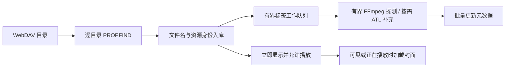

# WebDAV 接入设计方案

日期：2026-09-21。状态：设计建议，尚未实施。

已确认范围：兼容 NAS/普通 WebDAV 和 AList/OpenList；曲库上千首，总大小接近 100 GB。本文中的并发、缓存和超时是建议初始值，不是实测性能承诺。

## 1. 推荐决策

| 问题 | 建议 |
|---|---|
| 在哪里添加地址 | 将现有“添加文件夹”升级为“音乐来源”；右上角“添加来源”包含“本地文件夹”和“WebDAV” |
| 是否单独做 WebDAV 音乐页 | 提供来源详情/远程目录浏览页，但歌曲进入同一个音乐库；不复制一整套歌曲、专辑、艺术家、收藏与播放队列页面 |
| 首次扫描方式 | 目录枚举和标签读取分离；先用文件名入库并允许播放，再后台补全标签 |
| 是否下载整库 | 不下载；自动元数据扫描禁止无界下载完整音频 |
| 元数据引擎 | 网络常用标签/技术字段优先评估现有 FFmpeg/libavformat；ATL 7.17.0 保留为特定格式/字段补充，本地读取不改 |
| 封面 | 命中缓存后优先用户自有 AudioCoverReader，通过可定位网络 Stream 复用；按需加载，不在首次扫描批量拉取 |
| 播放 | 复用 AudioPlayer 的 StreamingClient；主程序增加来源解析、状态协调和凭据管理 |
| 数据 | 统一 Music.Id，新增远程来源/文件详情；稳定资源身份与临时播放 URL 分开 |
| 同步 | 默认手动更新；可选启动后后台更新目录；不在启动时完整重读所有标签 |
| 第一版写操作 | 远端只读；收藏、歌单、统计、歌词偏移保存在本地 |

## 2. 已核实的现状与限制

以下是本次阅读代码得到的事实：

- `WinUIMusicPlayer.csproj` 引用 `z440.atl.core 7.17.0`。
- `View/MainPage.xaml` 已有 AddFolder 和 MusicBrowse 两个入口；`View/AddFolderPage.xaml` 已有添加按钮、来源列表和空状态，适合扩展。
- `Services/AddFolderService.cs` 通过 Directory/StorageFile 枚举和读取本地文件；`Utils/ToolUtils.cs:GetMusicInfo` 使用 `new Track(file.Path)`，不能直接承担 WebDAV 扫描。
- `Services/ScanPipeline.cs` 已有 4 个工作任务、有界结果通道、128 项批量提交，可复用设计思路，但其同步输入枚举不能直接当作异步 WebDAV 遍历器。
- `Model/Music.cs` 的 Path/FolderPath、`Services/MusicDatabaseService.Scanning.cs` 的路径归属和 NOCASE 比较，以及 `Reader/AudioCoverReader.cs` 的 File.Exists/FileStream 都有本地文件语义。
- `Services/LibraryQueries.cs` 的文件夹索引依赖 LastLevelFolderPath，同名远程目录不能继续只按末级名称区分。
- `Services/LibraryProjectionService.cs` 已统一歌曲/专辑/艺术家/文件夹/收藏投影，其查询缓存键需要加入来源条件。
- `Services/PlaybackCoordinator.cs` 当前调用播放器后就发布曲目并开始统计；网络准备时间较长，必须区分“选中待播”与“实际开始播放”。
- `Services/BassPlayerCommandService.cs` 当前通过 `IpcService.Play(music.Path)` 播放，暂停和定位也走旧入口；仅给列表加入远程 URL 不足以完成接入。
- AudioPlayer 已有 prepare/play/pause/stop/seek/refresh/status，支持 HTTP(S)、请求头、有界预缓冲、取消及失败状态。主程序还没有把上述能力纳入统一播放流程。
- 当前网络错误是 OpenOrReadFailed/ReadFailed 等粗粒度代码，不能直接据此准确区分 401、临时直链过期或服务器不可达。
- `AudioConverters/FFmpegMetadataProbe.cs` 已有 libavformat 技术字段探测，但明确只允许 file 协议、不返回 Title/Artist/Album；需要新增网络入口，不能直接复用现有入口宣称支持 URL。
- `Utils/ToolUtils.cs:GetRawImage` 已优先对 mp3/flac/m4a/wav/ogg/opus/oga 调用自有 AudioCoverReader，其他格式才用 ATL。AudioCoverReader 的内部格式解析器已接受 Stream，公共入口仍只有本地路径。

本轮只产出设计文档；没有运行真实 WebDAV 扫描或 ATL 网络读取基准，不将此前 AudioPlayer HTTP 测试等同于 WebDAV 端到端验证。

## 3. 页面与交互

### 3.1 音乐来源页

保留当前导航位置、卡片/列表样式和 MVVM，页面展示名称改为“音乐来源”。技术上的页面重命名可以后置，避免为了改名称搬动全部文件。

```text
音乐来源                                  [添加来源 ▾]
                                          本地文件夹
                                          WebDAV
本地
  D:\Music                 1,020 首          [⋯]

WebDAV
  家庭 NAS                 1,860 首          [⋯]
  已读取标签 1,230 · 待补全 630 · 最近同步 12:40
  网盘音乐                 未连接            [重新连接] [⋯]
```

来源卡片操作：浏览目录、查看歌曲、更新目录、补全歌曲信息、暂停/继续扫描、编辑连接、清理缓存、移除来源。连接状态、目录扫描状态和标签完成度分别表示，避免一个“扫描中”涵盖所有阶段。

“查看歌曲”进入现有音乐库并设置 SourceId 过滤；“浏览目录”进入来源详情，展示服务端目录树和面包屑。来源页负责管理，音乐库负责听歌。

### 3.2 添加 WebDAV

第一步填写连接信息：名称、WebDAV 根地址、用户名、密码/应用密码。“服务类型”可选自动/普通 WebDAV/AList 或 OpenList，仅用于提示和诊断，不依赖供应商私有 API 才能工作。

第二步“连接并选择目录”：用 PROPFIND 验证目录权限，显示目录树，允许选择一个或多个音乐根目录。保存地址规范化结果，保留服务端返回的真实路径；同一来源的父子根重复选择要去重。

第三步“添加并扫描”：默认快速建立目录索引并后台补标签。高级选项只保留用户能理解的项：是否后台补全、是否在启动后更新目录、扫描带宽限制；不把 Range 块大小、IPC 会话等实现参数放进普通流程。

连接测试分别报告：可列目录、抽样文件可读、可分段读取。空目录只能证明目录权限，不能宣称所有文件可播放。一个挂载的 Range 结果不能代表 AList/OpenList 下全部挂载。

第一版支持匿名和 Basic/应用密码认证。Digest、交互式 OAuth、企业单点登录应明确列为未验证/后续兼容项，不能以“所有 WebDAV”承诺支持。默认建议 HTTPS；使用 HTTP 时界面明确标识未加密。自签名 NAS 证书通过系统信任配置处理，不提供全局跳过证书校验开关。

### 3.3 统一音乐库

歌曲、专辑、艺术家视图上方增加来源筛选：全部/本地/WebDAV/具体来源。默认全部，记忆用户上次选择；本地用户没有 WebDAV 时不增加无意义控件。

- 远程歌曲用小型来源标识，列表和详情中可查看来源名称。
- 标签待补全：标题先用文件名，艺术家/专辑显示未知，时长显示“—”，仍可播放。
- 文件夹名只能作为辅助提示，不默认伪造为真实专辑标签；完整标签入库前不把所有未知歌曲合成一个巨大“未知专辑”。
- 补标签按批次更新；用户滚动、选中和播放中的条目不因每首回写反复跳位。完成一批后再刷新排序/分组，并保持滚动锚点。
- 来源筛选同时应用于搜索、数量统计、专辑/艺术家投影，不能只过滤歌曲列表却保留全库计数。
- 同曲本地副本和远程副本保留两个条目，不自动按标题或文件名去重；手动跨来源混合歌单正常工作。
- 同名专辑第一版至少在来源过滤内分组；来源未过滤时使用来源加专辑/艺术家上下文避免误并。更完整的发行版识别是独立需求。

### 3.4 操作能力

| 操作 | 本地歌曲 | 远程歌曲第一版 |
|---|---|---|
| 播放、收藏、加入歌单、统计 | 保持现状 | 支持，复用同一份 Music.Id |
| 标签编辑并写回文件 | 保持现状 | 禁用，并解释远端只读 |
| 在资源管理器打开 | 保持现状 | 改为打开来源中的目录 |
| 本地转码、移动/删除文件 | 保持现状 | 不直接调用现有命令 |
| 歌词偏移、手动歌词 | 保持现状 | 本地保存，按歌曲 ID 关联 |
| 清理失效曲目 | 按本地规则 | 不使用 File.Exists；按远程同步结果标记 |

“移除来源”只删除本应用的来源和关联索引，不删除 NAS/网盘文件。操作前展示影响歌曲数及歌单引用，按同一事务/协调流程清理引用和当前播放；“暂时禁用”则保留条目和收藏。

## 4. 元数据引擎选择与 ATL 的网络能力

### 4.0 支持 HTTP URL 的方案比较

| 方案 | 直接 HTTP URL | 对本项目的判断 |
|---|---|---|
| FFmpeg/libavformat + FFmpeg.AutoGen | 支持；现有网络版 DLL 已具备协议 | 首选网络探测候选，复用现有依赖；扩展现有 Probe 的网络入口和标签映射 |
| MediaInfoLib | 具备网络读取能力，依赖实际构建和 libcurl 支持 | 备选；引入另一套原生库/网络依赖，当前无充分收益支撑替换 |
| ATL 7.17.0 | Track(string) 不支持 HTTP；支持 Stream | 本地保留；远程通过自有 Range 流做字段/格式补充 |
| TagLib# | 标准文件入口不是现成 HTTP 客户端；IFileAbstraction 可接自定义流 | 换成它仍需网络流/缓存/取消适配，不能因此消除工程量 |

这里“直接支持 URL”指能自行打开 HTTP 资源，不意味着自动低流量、不意味着具备 WebDAV 目录同步，也不意味着无需处理鉴权和直链过期。封装 ffprobe 的 .NET 库通常仍需部署可执行程序；项目已有 AutoGen/DLL，第一版不为每首歌额外启动 ffprobe 进程。

推荐网络路径：WebDAV 列目录 → 有界远程 FFmpeg Probe（常用标签与音频参数）→ 针对已知缺失格式/字段按需 ATL 补充。不是对每首歌都连续扫两遍；是否启用 ATL 后备由格式策略和阶段 0 的字段一致性样本决定，fallback 共用同一首歌的总流量/时间预算。自定义标签、歌词和多值字段不能假设 FFmpeg 与 ATL 完全等价，必须保留字段来源和缺失状态。

FFmpeg Probe 读取 format.metadata 和选中 audio stream.metadata，映射 title/artist/album/album_artist/date/track/disc 等；字段优先级需固定并测例，不使用 attached_pic 的图像流覆盖音频流信息。技术字段使用 codecpar 和容器/流时长；未知值保持未知，不伪造位深或精确时长。

保留现有本地 TryProbe 契约，新增远程请求/结果类型，包括取消、失败分类、字段完整性和耗用预算。probesize/analyzeduration/max_probe_packets 只限制特定探测阶段，不是所有 HTTP 下载字节的硬上限；硬上限必须在受控传输/桥接或自定义 AVIO 层计数并截断，回退仍消耗同一预算。严格中断回调覆盖打开与探测，原生上下文只由工作线程清理。

自有封面读取仍需要可定位 Stream，所以即便 FFmpeg 成为主要标签引擎，RangeReadStream 也有直接用途，不必为避开这层而引入第二套元数据依赖。

### 4.1 确定结论

当前本地 7.17.0 包的 ATL.xml 明确说明字符串构造只支持本地路径，HTTP/FTP 不适用；同时提供 `Track(Stream, string mimeType)`。官方当前源码也显示 Stream 构造时访问 Position。

因此：不能直接 `new Track("https://...")`；也不能假设 HttpClient 返回的普通顺序响应流可直接满足解析器。可以由我们实现可读、可定位、具有正确 Length/Position 语义的流，再由 ATL 解析。传入真实扩展名如 `.flac`，避免服务端统一返回 application/octet-stream 时识别困难。

7.17.0 本地 XML 还提供 `AudioFileIO(Stream, string, bool readEmbeddedPictures, bool readAllMetaFrames)`。第一版优先通过每实例选项关闭图片和不需要的附加字段，不在并发扫描期间反复修改 ATL 全局静态 Settings。是否所有格式都会跳过图片实际字节，必须用读取轨迹测量，不能从“关闭图片加载”推导出“零图片网络流量”。

### 4.2 可定位网络流

拟新增 HttpRangeReadStream，供自有封面解析及 ATL 补充读取使用，与 FFmpeg 远程 Probe 共用传输、身份、版本和预算策略：

1. 获取文件大小与资源版本；优先复用 PROPFIND 属性，首次实际 GET 再校验。
2. 首次需要数据时请求约 128 KiB 块；Seek 只移动逻辑位置，随后 Read 命中缓存或发起对应 Range 请求。
3. 相邻读取合并，已读取块复用；实现同步 Read/Seek 以适配 ATL，在固定数量后台工作任务内调用，不在 UI 线程同步等待 HTTP。
4. 底层传递取消和请求超时；取消后等待该解析任务实际结束再释放流，不能仅用 WaitAsync 超时丢弃还在读取的解析器。
5. 只读：CanWrite=false，不允许 ATL Save 写回远端。
6. 不把头尾两段简单拼成 MemoryStream，也不为缺失字节填零伪造完整文件；两者会破坏文件偏移和解析正确性。
7. 每首受字节数、请求次数、时间三个预算约束；超限标为 Deferred，保留已经可靠读取的基础数据，不宣称标签完整。
8. 验证 206 与 Content-Range 的起止位置/总长度；Range 被忽略并返回 200 时停止自动大文件标签扫描，不静默下载整首。
9. 请求 identity 表示避免透明压缩改变偏移。缓存键包含资源身份和版本；强 ETag 优先用于条件读取，资源变化则丢弃旧块。弱 ETag、长度加修改时间只能提供较弱保障，要标记可信度。

### 4.3 格式差异

| 格式 | 网络元数据读取策略与风险 |
|---|---|
| FLAC | 通常从头部元数据块取得标签和音频属性；大 PICTURE 块需要跳过或延后 |
| MP3 | 头部 ID3v2、可能的尾部 ID3v1/APEv2；精确 VBR 时长不保证靠固定头部可得到 |
| M4A/ALAC | moov 可在文件前或后，必须支持任意偏移定位，不能假设下载前 1 MiB 一定够 |
| DSF/DFF | 标签位置可能靠后；大文件尤其不能按整首缓存策略处理 |
| APE/WavPack | 可能需要尾部标签/块信息，使用可定位流而非仅前缀 |
| Ogg/Opus | 标签通常靠前，精确时长可能需要末尾页，部分情况读取范围较大 |

以上是读取策略，不是“所有文件两次请求读完”的保证。必须使用项目真实格式样本验证 ATL 的读取模式。FFmpeg 作为网络主候选同样可能为探测读取很多字节；播放时已获得的时长/音频参数可以回填，但不能成为无限制后台扫描的隐性后门。

## 5. 扫描、速度和流量

### 5.1 三阶段流水线



阶段 A：用 PROPFIND Depth:1 遍历选定目录，获取 href、resourcetype、displayname、getcontentlength、getlastmodified、getetag；不依赖 Depth:infinity。只申请必要属性，解析 207 时逐项看 propstat，失败属性不等于文件不存在。标准 WebDAV 目录列表不保证包含音乐标签，也没有可假定通用可用的分页机制；单个超大目录用流式 XML 解析和有界批量入库。

阶段 B：目录枚举和元数据工作并行推进，但调度独立。先处理当前播放/可见/用户选中曲目，再处理其他待补全项目。对 NAS 默认 2 个标签任务；对 AList/OpenList 默认 1 个，验证服务稳定后可升到 2 个。目录并发默认 2，元数据全局并发上限建议 4；共享请求预算，避免多个来源叠加失控。

阶段 C：封面与歌词按需补全。遵循用户要求，顺序为“有效本地缓存 → 自有 AudioCoverReader 读取内嵌封面 → 同目录已列出的 cover.jpg/folder.jpg → 未覆盖格式的 ATL 按需回退 → 默认封面”；第三方在线搜图保持显式/已有设置控制，不在大库后台扫描自动触发。已覆盖格式读不到图片不默认再让 ATL 重扫同一文件，避免无效重复读取。

实现时给 AudioCoverReader 增加 Stream + 扩展名入口，保留当前本地路径入口；内部现有 MP3/FLAC/WAV/Ogg/MP4 解析器继续使用。当前 AIFF/APE 公共分派是注释状态，不能因为内部方法存在就宣称已支持。网络流必须可 Seek：现有 Skip 对不可定位流会逐字节读掉整个跳过区间，可能造成大流量。明确流的所有权由调用方持有，并区分“无封面”“格式不支持”“预算耗尽”“取消”“损坏”，不能把预算/取消吞成空封面后继续启动下一层请求。

图片独立预算：自动展示初始建议最多 8 MiB 实际读取，超过后保留占位图；当前解析器 30 MiB 分配保护仍作为上限，用户主动读取大封面可采用更宽预算。生成尺寸受限缩略图并限制解码后像素数；同目录共享图按资源版本复用，不能假设同专辑名必然同封面。缓存有效性改为远程 ETag/大小/修改时间，不调用 File.GetLastWriteTime(music.Path)。远程同名 .lrc 可通过目录索引按需 GET；未补齐 artist/title 前不批量触发外部歌词搜索。

播放优先于后台扫描：本来源播放打开和缓冲不足时暂停新的标签请求，恢复后低速继续；封面快速滚动时取消过时任务。UI 每 250–500 ms 或每 64–128 项合并发布，不每个网络块更新绑定。

### 5.2 初始预算建议

| 项目 | 建议初始值 | 行为 |
|---|---|---|
| Range 块 | 128 KiB | 合并相邻读取，测量后调优 |
| 普通后台标签任务 | 2 MiB / 16 个请求 / 15 秒，先达到者为准 | 超预算保留基础条目，标记需进一步读取 |
| 用户主动“深度读取信息” | 16 MiB / 64 个请求 / 60 秒 | 仍有上限，执行前展示可能流量 |
| 瞬时块缓存 | 每个工作任务 8 MiB 上限 | LRU 或按任务释放，绝不按文件大小分配 |
| 持久图片缓存 | 全局 256 MiB 初始上限 | LRU，可清理；与数据库元数据分开 |
| 自动完整音频下载 | 禁用 | 缺 Range 的大文件只保留基础信息 |

可定位流的逻辑 Length 可以是几百 MB，但其实际内存/下载量只取决于读取预算。第一版不做持久音频分块缓存或离线下载，避免额外占用接近整库的磁盘。未来如果加入下载，应独立显示空间、取消和清理能力。

### 5.3 接近 100 GB 会不会慢

目录列表速度主要取决于目录数、服务器响应、挂载是否休眠；标签速度主要取决于歌曲数、每首实际请求次数、延迟和平均读取字节。100 GB 不是本设计的扫描下载量。

仅作量级计算，假设 2,000 首：

- 平均每首读取 128 KiB，总音频探测流量约 250 MiB。
- 平均每首读取 512 KiB，总量约 1,000 MiB。
- 如果全部碰到 2 MiB 默认上限，总量可能接近 4 GiB；预算仍需要进度展示和可暂停，不能称为“几乎不耗流量”。
- 若整库下载 100 GB，100 Mbps 理论最短约 2.2 小时，20 Mbps 约 11.1 小时，均未计协议和服务器开销，因此不采用该方式。

粗估式：T ≈ N ×（R × RTT + B / 有效单任务吞吐量 + 服务端等待）/ 有效并发度；实际还受共享总带宽约束，不能把并发倍率重复计算。示例 2,000 首、每首 3 次请求、RTT 100 ms、并发 2，仅延迟项就约 5 分钟；加入每次云盘解析/重定向等待后可能显著变长。这是说明“为什么慢”的假设计算，不是实测 ETA。

用户可见目标：目录首批结果返回后尽快显示，标签没扫完也能听；进度分别展示“已发现歌曲数”和“已读取信息/待处理/需深度读取/失败”，目录没枚举完时不显示伪精确百分比。记录实际下载字节、请求数与滚动吞吐，再给出估计剩余时间。

## 6. 增量同步与失败恢复

- 目录枚举新增歌曲；已有歌曲比较 ETag 或长度/修改时间，变化才重读标签。服务器没有可靠验证信息时按较长周期或用户手动触发重读，不假装能保证即时发现变化。
- 不依赖父目录 mtime/ETag 判断所有后代都没变化。标准 WebDAV 不等于文件监视；未来仅在检测到扩展能力后才使用同步令牌。
- ScanRunId/LastSeenGeneration 记录本次覆盖范围。只在相关目录枚举完整成功之后对其范围内的未出现条目标记 Missing；目录部分失败、401、超时、取消、断网绝不作为删除依据。
- Missing 保留 Music.Id、收藏和歌单引用，默认在普通随机播放中跳过；源离线仅标记来源状态。404 需要区分真实 DAV 路径不存在与临时直链已过期，后者重新解析来源后再判断。
- 失败项目有退避时间；401/403 停止该来源任务并提示重新认证；429 尊重 Retry-After，5xx/超时有限重试。用户取消不算错误，不循环重试。
- 重启后从数据库待处理状态继续补标签。未完整完成的目录扫描重新列举相关目录，不依赖不存在的通用 WebDAV 分页游标。
- 重扫只更新元数据字段，不覆盖收藏、播放次数、歌单顺序、歌词偏移和手工覆盖信息。
- 第一版不自动识别远端重命名为原歌曲；除非服务端提供可靠稳定资源 ID，否则采用旧项 Missing、新项新增，防止错误合并。

## 7. 数据与职责

### 7.1 建议存储模型

| 对象 | 关键数据 |
|---|---|
| Music | 保持 Id/标题/艺术家/专辑/用户数据；新增 SourceKind、MetadataState、Availability；远程 Path 不存临时 URL |
| WebDavSource | SourceId、名称、BaseUri、认证方式、CredentialKey、启用/同步策略、最近状态 |
| WebDavRoot | 来源 ID、选择的根目录 href；一个连接可选多个根目录 |
| RemoteTrack | MusicId 一对一关联、SourceId、规范化资源 href/ResourceKey、文件大小、ETag、LastModified、标签版本、最后发现代次 |
| ScanRun / ScanWork | 扫描范围/完整性、待处理阶段、重试时间、字节/请求统计；不用为每个音频块落库 |
| 播放描述符 | 临时 URL、临时 Headers、有效期、CanSeek；仅内存存在，不作为曲目主键 |

保留现有 Music.Id 可避免复制收藏/歌单/历史系统；远程专有字段放扩展表而非为每个本地条目增加大量空列。迁移后旧 Music 默认 LocalFile，所有本地路径查询、存在性检查、监视器、外部导入归属及写标签逻辑明确加来源限定；远程 Path 留空也不能导致本地查重将所有远程项合为一个。

远程唯一键为 SourceId + 规范化资源标识，按大小写敏感规则保存路径；不能套用 Windows OrdinalIgnoreCase/NOCASE。BaseUri 的主机规范化与路径规范化分开处理；保留服务端有效百分号编码语义，不双重解码，不把编码斜杠误作目录分隔，不擅自合并 Unicode 等价名字。目录根约束按 URI 路径段判断。

凭据用 Windows 凭据存储，数据库只放关联键；相同服务器不同账号是不同来源。日志不记录 Authorization、密码、完整签名查询串。导出/备份默认不携带凭据和临时直链。

### 7.2 服务边界

- WebDavClient：PROPFIND、GET/Range、URI、鉴权、重定向、错误分类与响应释放。
- RemoteLibrarySyncService：目录同步、任务调度、重试、批量数据库提交；生命周期由启动/退出协调器显式管理。
- RemoteMetadataReader：以有界 FFmpeg Probe 为网络主候选、可定位流 + ATL 为按需补充，只返回元数据结果/读取状态，不直接修改 UI。
- PlaybackSourceResolver：从 Music.Id/来源解析当次可播放描述符，不管理歌曲列表。
- PlaybackCoordinator / 播放适配层：统一选曲、准备、明确 Play/Pause 意图、会话替换和状态发布；不为 WebDAV 建第二套全局播放状态。
- Cover/Lyrics 服务：按来源分派读取，并复用现有缓存/展示流程。
- 页面 ViewModel：持有连接表单、来源展示及命令；View 仅布局和事件转发。

本地 LibraryOperationGate 不能被几分钟网络扫描长期占用。来源有独立扫描任务，数据库短事务串行提交；全局数据迁移/清库仍有协调屏障。后台结果携带来源版本/任务代次，来源被修改/移除后迟到结果不得重新入库。

## 8. NAS 与 AList/OpenList 的播放接入

### 8.1 资源身份与临时地址

ResourceId 使用稳定的远程记录 ID；SourceId/href 是重新解析入口。AList/OpenList 的 302 目标通常是一次性或临时直链，不能永久保存为 Music.Path，也不能当作扫描差异比较的依据。不同挂载的重定向/Range 能力分别检测，失败不能永久污染整个服务器的能力缓存。

### 8.2 鉴权和重定向的推荐边界

元数据和目录走主程序统一 HTTP 传输层；关闭不受控的自动转发鉴权头，限制重定向次数，跨源重定向移除源服务器凭据，同源凭据也受来源配置约束，不自动接受 HTTPS 降级。

已有 AudioPlayer 会把描述符中的自定义 headers 交给 FFmpeg；现有测试没有覆盖“携带 Authorization 时跨域 302”的凭据隔离。因此不能直接宣称把 NAS 账号头交给 FFmpeg 就完成兼容。

建议第一版：对需要鉴权或会发生供应商重定向的 WebDAV 播放，增加受控本机只读 HTTP 桥接。AudioPlayer 取得带随机会话令牌的 loopback URL，主程序桥接负责上游鉴权/重定向并流式转发 GET/Range。它不把音频整首下载，也不做解码或磁盘音频缓存；缓冲固定、有背压。这样播放与元数据使用同一套 HTTP 身份边界。无鉴权的可信最终直链可作为后续优化直连，不阻塞第一版。

桥接必须：只绑定 loopback、令牌限定单个资源且可撤销、只允许 GET/HEAD、禁止任意 URL 参数代理、限制连接数/请求头大小、正确转发 206/200/416/长度、资源版本一致性检查、在播放器停止时取消上游请求并释放连接；应用退出先停播放器会话，再释放桥接和 HTTP 客户端。请求期间所有权明确，不能等待端口关闭就当作上游下载已停止。

这是新增工程量，但对于同时兼容鉴权 NAS 和云盘 302，边界比到处手工拼 Authorization 更清楚。它不等于 OpenList 服务端的“本机代理”设置；后者是远端部署策略，本方案桥接运行在播放器电脑上。

### 8.3 播放状态与现有系统

```text
选择歌曲 → Resolving → Preparing → Buffering → Playing
                               ↘ Paused（用户意图优先）
Playing → Buffering → Playing / Paused / Failed / Ended
```

- 主程序持有一个当前播放请求代次和 AudioPlayer SessionId；A→B 快速切歌后，A 的迟到准备/状态不得覆盖 B。
- 所有页面、快捷键、系统媒体键使用同一命令路由。远程打开中 Pause 必须保留，不能被准备完成覆盖。
- 提前更新待播标题可以，但统计累计以实际 Playing 和有效进度为准；缓冲、失败和暂停不计听歌时间。
- 远程状态由当前 SessionId 的 status 驱动；进度邮箱只在会话匹配时使用。旧 PlayEnded 通知没有 SessionId，网络播放阶段应避免同时由旧通知和新状态双重触发下一首；必要时扩展协议携带会话/代次。
- 第一版不强制跨曲预加载：现有播放器最多两个槽位，先保证选曲/取消/混合队列正确；后续最多预准备下一首，用户切歌优先清理旧预加载。
- 当前接口没有可直接用于精准鉴权续期的 HTTP 错误码。桥接返回结构化的主程序错误，或扩展 StreamReply 的可选错误分类/Retryable/源错误字段并做能力协商，不能解析日志文案判断 401。
- 临时地址过期：重新解析原 DAV 资源，有限重试；重开时使用 refresh 保留位置和 WantsPlay。无 Range 或实体版本已变时不能假装从旧位置继续；提示重新从头播放。
- 网络失败默认保留当前曲目并提供重试，不按自然 EOF 自动跳到下一首，防止账号过期时跳完整个歌单。
- 无 Range 的文件按格式尽力顺序播放，不保证所有容器都能起播；定位按钮禁用并解释原因。

## 9. 分阶段交付

### 阶段 0：技术验证先行

选取覆盖 FLAC/MP3/M4A/DSF/APE/WavPack/Ogg 的小样本，包含头部/尾部标签、大封面、VBR；在 NAS 与 AList/OpenList 上分别记录 FFmpeg 和 ATL 每首读取字节、请求偏移/次数、耗时、取消延迟与字段完整度，确认网络主引擎和格式级回退策略。单独验证自有 AudioCoverReader 的封面字节与本地结果一致。验证预算终止不会留下半完整数据被误标成功。并测试鉴权/302/Range 桥接与现有 NativeAOT 播放器。

交付的是可量化结论：普通标签是否多数落在默认预算内、哪些格式需降级；不能预先承诺 100 GB 曲库几分钟完成。

### 阶段 1：最小完整体验

音乐来源页、添加/测试/选目录、文件名快速入库、稳定资源身份、统一音乐库来源过滤、远程顺序播放/暂停/定位/混合歌单、凭据保存、错误与离线状态。标签未完成不阻塞起播。加入完整退出清理与数据库迁移回归。

### 阶段 2：元数据与增量同步

有界远程 FFmpeg 探测与 ATL 按需补充、后台补标签、自有封面解析的 Stream 适配、封面/歌词按需缓存、ETag 增量、断点恢复、缺失标记与扫描流量进度。这一阶段完成后作为面向上千首曲库的首个正式版本。

### 后续增强

用户主动深度读取、可配置扫描限速、下一曲预缓冲、可验证的直链优化、离线下载、特定服务器同步扩展。远端标签写回、文件删除/移动、OAuth、CUE 多轨等分别立项，不塞进首次接入。

## 10. 验收标准

- 真实 NAS/普通 WebDAV 至少一个实现，AList/OpenList 至少覆盖直返和 302 两种策略；不能只用本地 HttpListener 证明兼容。
- 上千首目录：首批内容可见且可点击播放；不等待全库标签读取，UI 无同步网络阻塞。
- 扫描实际下载字节与预算一致；大文件/大封面不会触发整库下载，取消后没有持续后台流量。
- 版本未变化的二次扫描不重新读取其音频标签；没有可靠版本信息时降级规则可观察。
- Range 被忽略、错误 Content-Range、416、资源在分段读取间变化、无 Content-Length、缺 ETag 都有可复现用例。
- 中文、空格、#、%、大小写不同名称、尾斜杠、绝对/相对 href、同名目录不误合并、不越过选定根。
- 401/403/429/5xx、TLS 错误、休眠 NAS、断网/恢复、目录部分失败不会删除库记录。
- AList/OpenList 直链过期可以重新解析；跨主机 302 不携带源 WebDAV 密码，loopback URL 不允许访问任意资源。
- 快速切歌、打开期间暂停/停止、定位后立即播放、本地与远程切换、来源删除与应用退出没有迟到状态覆盖、重复下一曲或资源泄漏。
- 收藏/歌单/统计使用同一 Music.Id；未补标签时长不显示为真实 0 秒；元数据回写不覆盖用户数据。
- 所有新增本地化 GetString 使用独立资源键并覆盖六种语言；保持现有 MVVM 与 UI 布局约定。

## 11. 建议待确认项

以下已有推荐默认值，不阻塞本设计阅读：

1. 是否接受“音乐来源管理独立、听歌列表统一”的页面安排：推荐接受。
2. 是否接受初扫先显示文件名、后台补标签：推荐接受，适合当前近 100 GB 曲库。
3. 是否接受第一版远端只读、不自动下载整首音频、不做离线库：推荐接受。
4. 默认手动更新目录，启动自动更新作为可选项：推荐，避免每次打开软件触发云盘请求。

## 12. 依据与核实边界

- 项目本地 NuGet 包：`C:/Users/90684/.nuget/packages/z440.atl.core/7.17.0/lib/net6.0/ATL.xml`，Track 构造文档及 AudioFileIO 实例选项；包 nuspec 标记源码 commit `6751eb15057f277a800996e8c7c03ed4b6858389`。本轮未成功从网站取得该固定 commit 源文件，7.17.0 结论以本地包 API 文档为依据。
- [ATL 官方 Track 源码](https://github.com/Zeugma440/atldotnet/blob/main/ATL/Entities/Track.cs)：当前主线公开实现作为补充，不能替代固定版本实测。
- [WebDAV RFC 4918](https://www.rfc-editor.org/rfc/rfc4918.html#section-9.1)：PROPFIND/Depth/属性及多状态响应。
- [HTTP RFC 9110 Range](https://www.rfc-editor.org/rfc/rfc9110.html#section-14.2)：服务器可能忽略 Range，应验证实际响应。
- [OpenList WebDAV 策略](https://doc.oplist.org/guide/drivers/common#webdav-policy)：区分 302、代理 URL 与远端本机代理。产品差异按运行时响应检测，不写死供应商行为。
- [FFmpeg 官方 ffprobe 文档](https://ffmpeg.org/ffprobe.html)：URL 输入、format/stream 元数据；本文建议直接用对应 libavformat API，不新增 CLI 依赖。
- [FFmpeg HTTP 协议](https://ffmpeg.org/ffmpeg-protocols.html#http)、[探测参数](https://ffmpeg.org/ffmpeg-formats.html#Format-Options)：网络与探测控制仍需应用层预算。
- [TagLib# 官方 File.cs](https://github.com/mono/taglib-sharp/blob/main/src/TaglibSharp/File.cs)：IFileAbstraction/ReadStream 适配边界。
- [MediaInfo 官方输入类型介绍](https://mediaarea.net/Events/PDF/2016-07-18_Symposium.pdf)、[当前构建说明](https://github.com/MediaArea/MediaInfo)：具备 HTTP/HTTPS 输入路线，实际分发构建及 Curl 依赖需要单独确认，本轮未验证其二进制。

缓存大小、并发度、读取预算、页面安排及本机桥接均为本项目设计建议；格式读取成本与服务兼容性仍需要阶段 0 实测。
